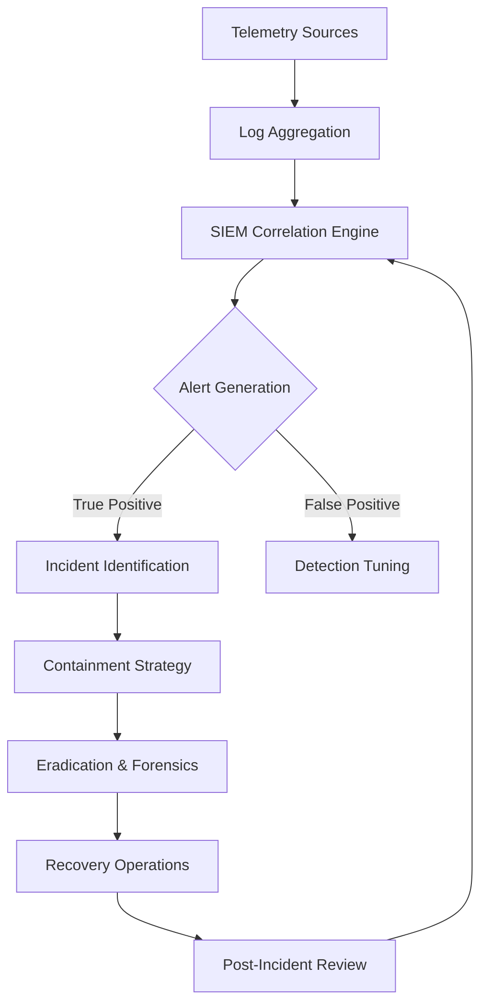

# Blue Team & SOC Operations Methodology

## Core Architecture & SIEM Paradigm
A resilient Security Operations Center (SOC) relies on a robust Security Information and Event Management (SIEM) architecture. The objective is holistic visibility across the enterprise telemetry plane, orchestrating log ingestion, normalization, correlation, and alerting. Data ontology must prioritize high-fidelity indicators over raw volume, enabling real-time detection engineering and proactive defense mechanisms.

## Incident Response Lifecycle (NIST SP 800-61 / SANS)
The structural foundation of incident handling dictates a deterministic approach to anomaly resolution.
1. **Preparation**: Establishing baselines, tooling, and communication protocols.
2. **Identification**: Differentiating malicious activity from benign operational noise via anomaly detection.
3. **Containment**: Halting the threat propagation while preserving forensic artifacts.
4. **Eradication**: Removing the root cause and associated persistence mechanisms.
5. **Recovery**: Restoring services to a verified secure state.
6. **Lessons Learned**: Integrating post-mortem intelligence into detection engineering.

## Threat Hunting & Hypothesis Generation
Proactive threat hunting transcends automated alerting. It requires the formulation of intelligence-driven hypotheses—assuming a state of compromise—to query historical telemetry for covert adversary behaviors, typically aligned with MITRE ATT&CK defensive mappings.

## Log Analysis Ontology
Conceptual log analysis demands parsing unstructured security events into actionable structured data. It involves correlating disparate timestamped entries across disparate systems (e.g., EDR, NDR, IAM) to reconstruct temporal attack vectors.

