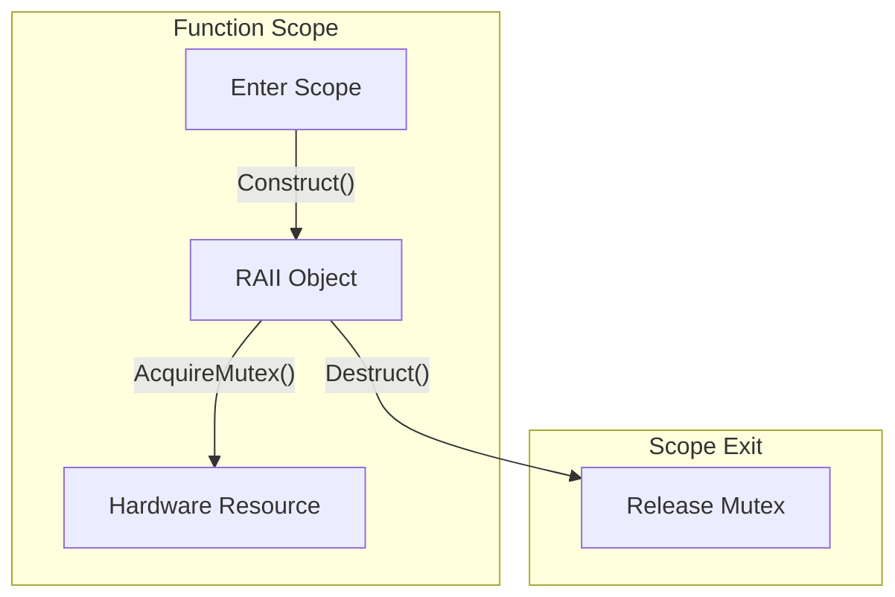

# C/C++ Embedded Patterns: Memory and RAII

In embedded C/C++, precise memory layout control is critical. Memory alignment ensures that variables reside at addresses that are multiples of their size, preventing unaligned access faults on architectures like ARM Cortex-M. The compiler introduces padding bytes in structs to satisfy these constraints.

RAII (Resource Acquisition Is Initialization) ties resource management to object lifetime. When an object is instantiated, its constructor acquires the resource (e.g., a hardware mutex). When the object goes out of scope, its destructor is automatically called, releasing the resource. Pointer arithmetic allows direct manipulation of memory addresses, essential for interacting with memory-mapped peripheral registers.

