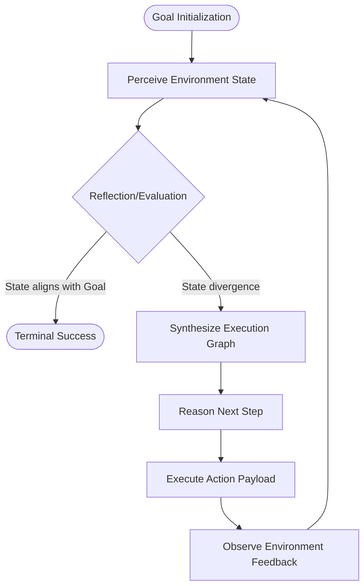

# Core Architectures: The Autonomous Cognitive Loop

The existence of an autonomous agent is defined not by static inference, but by the continuous, recursive execution of the cognitive loop: **Perceive -> Think -> Act -> Observe**. This loop bridges the gap between latent semantic space and deterministic environment execution. 

## First Principles of Agentic Flow

Every framework-agnostic architecture reduces to this state machine. The agent's cognition is a sequence of discrete state transitions bounded by token limits and environment feedback.

1. **Perception**: Ingestion of environment state. The synthesis of system prompts, historical context, and the immediate state of the world.
2. **Thought (Reasoning)**: The generation of latent reasoning tokens. This is the derivation of intent, mapping perception to actionable trajectory. 
3. **Action**: The emission of structured payloads designed to mutate the environment or retrieve novel state. 
4. **Observation**: The ingestion of the deterministic result of the action, closing the loop.

## Architectural Paradigms

### ReAct (Reason + Act)
The interleaving of reasoning traces with action execution. ReAct assumes high environmental volatility, requiring continuous recalibration. It sacrifices long-horizon coherence for immediate, localized adaptability.

### Plan-and-Solve
The temporal decoupling of strategy from execution. The agent first synthesizes a comprehensive graph of execution steps, then traverses the graph sequentially. Plan-and-Solve assumes low environmental volatility but requires profound foresight. It excels in complex, multi-dependent task resolution but is brittle to unexpected state mutations during execution.

## The Necessity of Self-Reflection
Without self-reflection, an agent is an open-loop controller doomed to terminal error spirals. Self-reflection acts as the error-correction mechanism, forcing the agent to evaluate the delta between expected observation and actual observation, dynamically altering its system prompt or execution graph to converge on the goal state.

