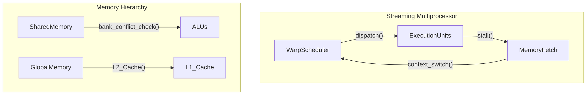

# CUDA GPU Architecture Mechanics

## Warp Scheduling
The Streaming Multiprocessor (SM) executes threads in groups of 32, called warps. Warp scheduling hides memory latency via zero-overhead context switching. When one warp stalls on a global memory load, the warp scheduler instantly selects another ready warp to execute its instructions. To maximize occupancy, developers must manage register file and shared memory allocations, as these are statically partitioned among active blocks. Divergence (when threads within a warp take different execution paths) causes the SM to serialize execution, significantly degrading performance.

## Shared Memory Banking
Shared memory is organized into 32 banks, allowing simultaneous access by all 32 threads in a warp. Bank conflicts occur when multiple threads request addresses mapped to the same bank, forcing the hardware to serialize the requests. Padding shared memory arrays or swizzling indices are common techniques to ensure a 1-to-1 mapping between threads and memory banks, enabling broadcast or conflict-free accesses.

## PTX Assembly
Parallel Thread Execution (PTX) is NVIDIA's intermediate instruction set architecture. It is Just-In-Time (JIT) compiled to SASS (Shader Assembly) by the device driver. Inspecting PTX or SASS is crucial for understanding register spillage (when registers exceed the limit and spill to slow local memory) and instruction-level parallelism. 

