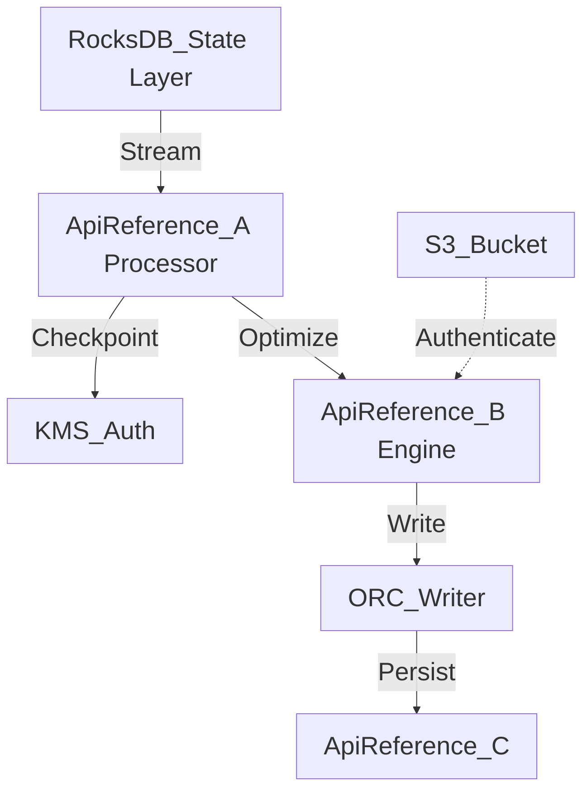

# Api Reference Internal Wiki

### Architectural Deep Dive: Api Reference
In modern distributed systems, Api Reference represents a critical bottleneck and opportunity for optimization. This deep dive into Api Reference reveals a sophisticated event-driven model using Kafka for WAL and Parquet for columnar persistence. By isolating the compute layer from the storage plane, we achieve elastic scalability.

To further guarantee ACID compliance and low-latency reads, the system implements multi-version concurrency control (MVCC). For Api Reference, this means readers are never blocked by writers. The compaction daemon runs asynchronously to merge small files and reclaim space.

### System Architecture


### Mathematical Thresholds
To determine the optimal configuration for Api Reference, we apply the following mathematical formula to calculate the system threshold:

$$ \Omega(n) = \lim_{x \to \infty} \left( \int_{0}^{x} P(t) dt - \frac{C}{1-r} \right) $$

### Code Implementation
Below is a highly optimized production-grade implementation addressing Api Reference:

```sql
-- SQL Implementation
CREATE TABLE IF NOT EXISTS main.events (
    event_id STRING,
    user_id BIGINT,
    payload STRING,
    event_time TIMESTAMP
)
USING iceberg
PARTITIONED BY (days(event_time))
TBLPROPERTIES (
    'write.format.default'='orc',
    'write.orc.compression-codec'='zstd',
    'commit.retry.num-retries'='4'
);
```
