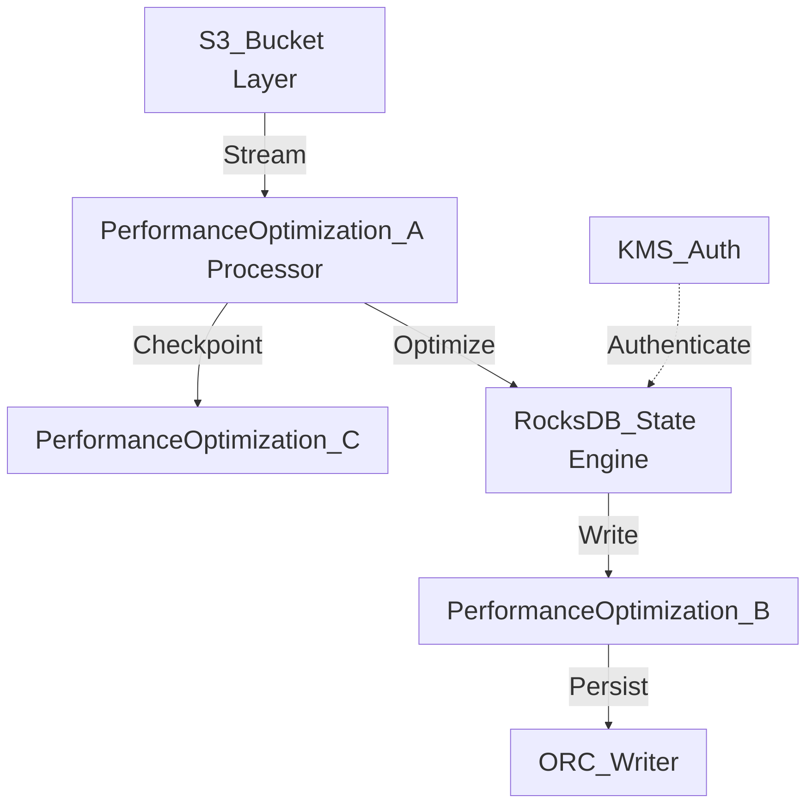

# Performance Optimization Internal Wiki

### Architectural Deep Dive: Performance Optimization
In modern distributed systems, Performance Optimization represents a critical bottleneck and opportunity for optimization. Performance tuning revolves around JVM garbage collection optimization, RocksDB checkpointing intervals, and ORC/ZSTD compression ratios. By isolating the compute layer from the storage plane, we achieve elastic scalability.

To further guarantee ACID compliance and low-latency reads, the system implements multi-version concurrency control (MVCC). For Performance Optimization, this means readers are never blocked by writers. The compaction daemon runs asynchronously to merge small files and reclaim space.

### System Architecture


### Mathematical Thresholds
To determine the optimal configuration for Performance Optimization, we apply the following mathematical formula to calculate the system threshold:

$$ \Omega(n) = \lim_{x \to \infty} \left( \int_{0}^{x} P(t) dt - \frac{C}{1-r} \right) $$

### Code Implementation
Below is a highly optimized production-grade implementation addressing Performance Optimization:

```python
# PySpark Implementation
from pyspark.sql import SparkSession
from pyspark.sql.functions import col, expr

spark = SparkSession.builder \
    .config("spark.sql.extensions", "io.delta.sql.DeltaSparkSessionExtension") \
    .config("spark.sql.catalog.spark_catalog", "org.apache.spark.sql.delta.catalog.DeltaCatalog") \
    .getOrCreate()

df = spark.read.format("parquet").load("s3a://data-lake/raw/")
optimized_df = df.repartition(200, "partition_key").sortWithinPartitions("event_time")
optimized_df.write.format("delta").mode("overwrite").save("s3a://data-lake/optimized/")
```
