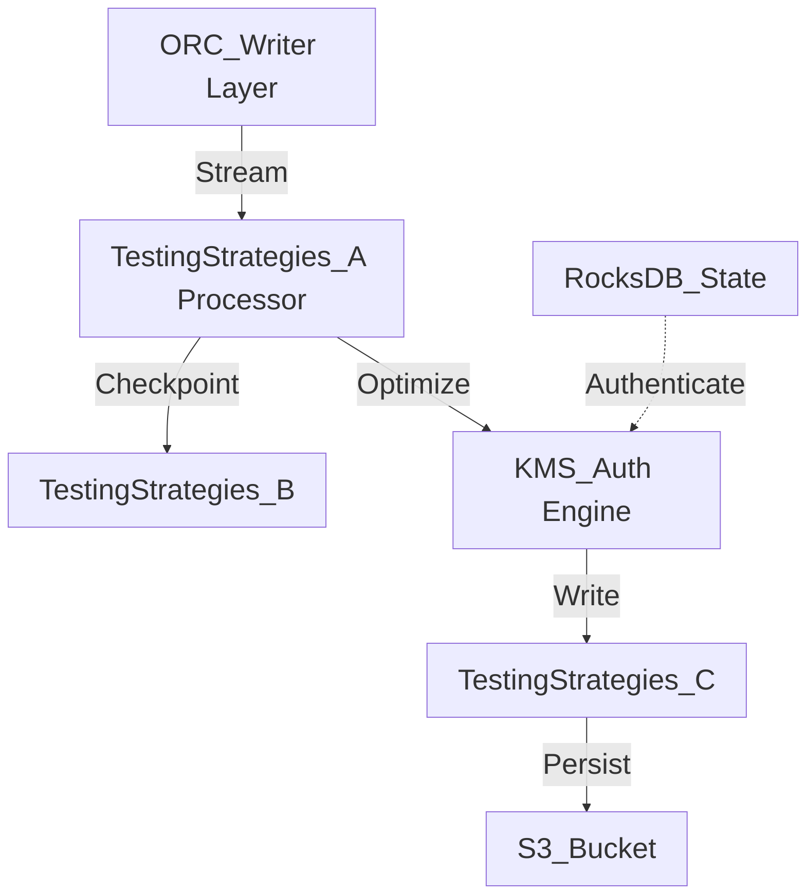

# Testing Strategies Internal Wiki

### Architectural Deep Dive: Testing Strategies
In modern distributed systems, Testing Strategies represents a critical bottleneck and opportunity for optimization. This deep dive into Testing Strategies reveals a sophisticated event-driven model using Kafka for WAL and Parquet for columnar persistence. By isolating the compute layer from the storage plane, we achieve elastic scalability.

To further guarantee ACID compliance and low-latency reads, the system implements multi-version concurrency control (MVCC). For Testing Strategies, this means readers are never blocked by writers. The compaction daemon runs asynchronously to merge small files and reclaim space.

### System Architecture


### Mathematical Thresholds
To determine the optimal configuration for Testing Strategies, we apply the following mathematical formula to calculate the system threshold:

$$ \tau_{latency} = \frac{1}{\mu - \lambda} + \sigma_{I/O}^2 $$

### Code Implementation
Below is a highly optimized production-grade implementation addressing Testing Strategies:

```python
# PySpark Implementation
from pyspark.sql import SparkSession
from pyspark.sql.functions import col, expr

spark = SparkSession.builder \
    .config("spark.sql.extensions", "io.delta.sql.DeltaSparkSessionExtension") \
    .config("spark.sql.catalog.spark_catalog", "org.apache.spark.sql.delta.catalog.DeltaCatalog") \
    .getOrCreate()

df = spark.read.format("parquet").load("s3a://data-lake/raw/")
optimized_df = df.repartition(200, "partition_key").sortWithinPartitions("event_time")
optimized_df.write.format("delta").mode("overwrite").save("s3a://data-lake/optimized/")
```
