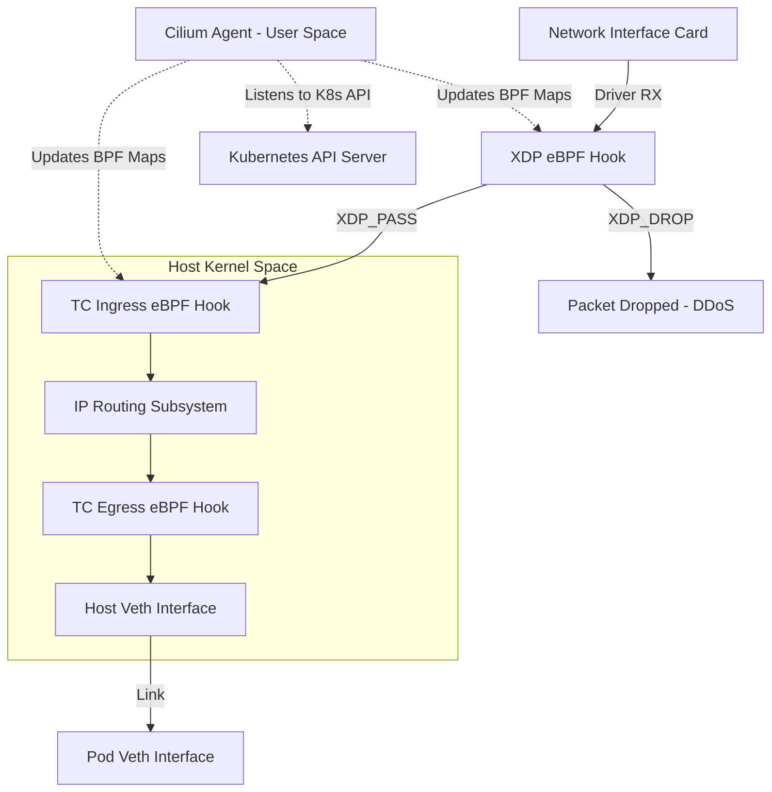

# Cilium & eBPF Networking: Kernel Space Packet Processing

## eBPF (Extended Berkeley Packet Filter) Fundamentals
eBPF allows sandboxed execution of user-defined bytecode within the Linux kernel. Programs are verified by the kernel's eBPF verifier to ensure safety (no infinite loops, bounds checking) and compiled via JIT (Just-In-Time) into native machine code. In networking, eBPF programs can be attached to various hooks (XDP, TC, cgroup socket hooks) to inspect, modify, or drop packets before they traverse the full kernel network stack.

## XDP (eXpress Data Path) Hooks
XDP provides the earliest possible interception point in the Linux kernel network data path, executing eBPF programs directly within the network interface controller (NIC) driver (or even offloaded to hardware).
- `XDP_DROP`: Discard packets at wire speed (ideal for DDoS mitigation).
- `XDP_PASS`: Pass packets to the standard network stack.
- `XDP_TX`: Bounce packets back out the same interface.
- `XDP_REDIRECT`: Forward packets to another interface or CPU queue.

## Cilium Architecture
Cilium heavily utilizes eBPF and XDP to implement high-performance container networking, security policies, and load balancing (replacing kube-proxy). Cilium attaches eBPF programs to the TC (Traffic Control) ingress/egress hooks on virtual ethernet (veth) pairs associated with pods. This allows for identity-based security policies enforced via eBPF maps rather than iptables rules. When combined with XDP, Cilium provides DSR (Direct Server Return) for LoadBalancer services, bypassing the standard netfilter stack entirely.

## Architecture Map

