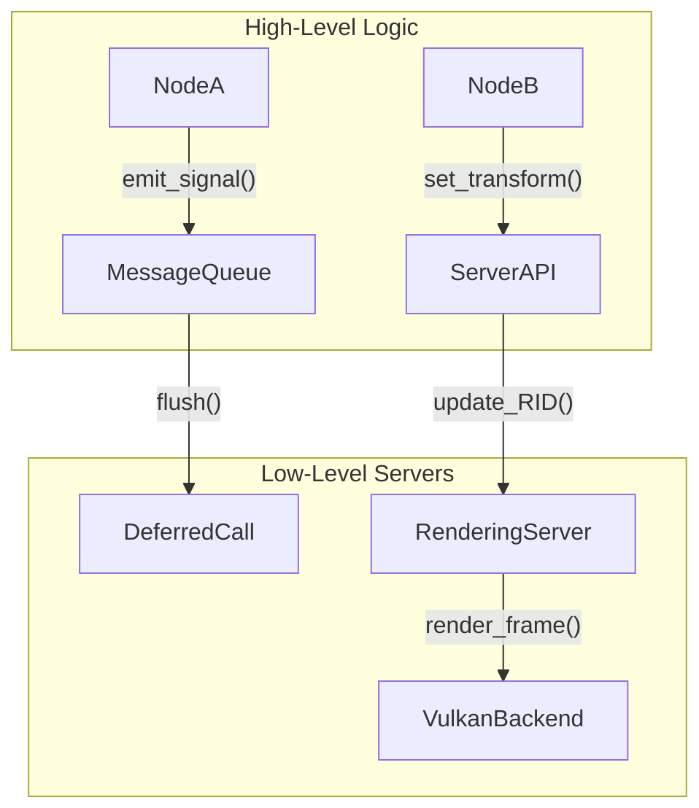

# Godot Engine internal Architecture

## Server Architecture
Godot completely separates the scene graph (Nodes, Tree) from the low-level processing by delegating hardware interaction and heavy lifting to "Servers". Servers are singletons (e.g., `RenderingServer`, `PhysicsServer3D`, `AudioServer`) that run highly optimized C++ code, often on separate threads. The SceneTree is essentially a high-level frontend that issues commands to these servers. 

## VisualServer (RenderingServer) Internals
The `RenderingServer` handles all drawing operations. Nodes like `MeshInstance3D` do not render themselves. Instead, they register a resource (e.g., an RID for a mesh) with the `RenderingServer` and update their transform matrices. The Server maintains its own spatial partitioning structure (like a BVH) to perform culling and rendering, allowing thread-safe decoupling from game logic execution.

## Signal Event Loop
Signals implement the Observer pattern at the engine core. When `emit_signal()` is called, it iterates over connected callables in the `Object`'s connection map. For deferred signals (using `CONNECT_DEFERRED`), Godot pushes the signal emission payload into a `MessageQueue`. The queue is flushed at the end of the current frame (during `SceneTree::process`), ensuring that state modifications do not corrupt iterative processes like physics callbacks.

