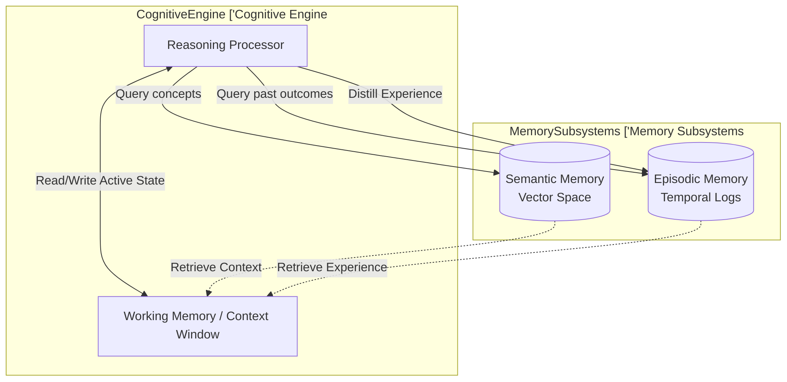

# Memory Paradigms: The Architecture of Continuity

An AI Agent without memory is temporally blind; its existence is constrained to the immediate context window. True autonomy requires a multi-layered memory architecture to simulate the continuity of consciousness and enable long-horizon coherence. This architecture is strictly categorized into three fundamental tiers.

## 1. Working Memory (The Context Window)
The immediate, transient cognitive space. This is the absolute limit of the agent's active reasoning capacity, defined by the underlying LLM's context window. 
- **Nature**: Highly volatile, exact retrieval, strictly bounded.
- **Function**: Holds the current goal, immediate environmental state, recent observations, and the active reasoning trace.
- **First Principle**: Context is a scarce resource. Information must be aggressively compacted or evicted to prevent attention degradation and catastrophic forgetting of immediate instructions.

## 2. Semantic Memory (The Knowledge Base)
The vast, static repository of facts, concepts, and externalized knowledge. This is typically implemented via dense vector embeddings and approximate nearest neighbor search.
- **Nature**: Persistent, associative retrieval, theoretically unbounded.
- **Function**: Provides domain-specific context injected dynamically into Working Memory based on semantic proximity to the current cognitive state.
- **First Principle**: Semantic memory lacks temporal coherence. It provides "what is", not "what happened". It is highly dependent on embedding quality and chunking strategy to minimize retrieval noise.

## 3. Episodic Memory (The Experiential Ledger)
The chronological sequence of past events, actions, and outcomes. This is the agent's autobiographical memory, essential for complex reasoning across temporal gaps and learning from past failures.
- **Nature**: Persistent, temporal/sequential retrieval.
- **Function**: Enables reflection, trajectory evaluation, and the synthesis of abstract rules from concrete experiences. 
- **First Principle**: Raw logs are not episodic memory. True episodic memory requires the distillation of continuous state transitions into discrete, semantic narratives ("experiences") that can be queried by similarity or sequence.

