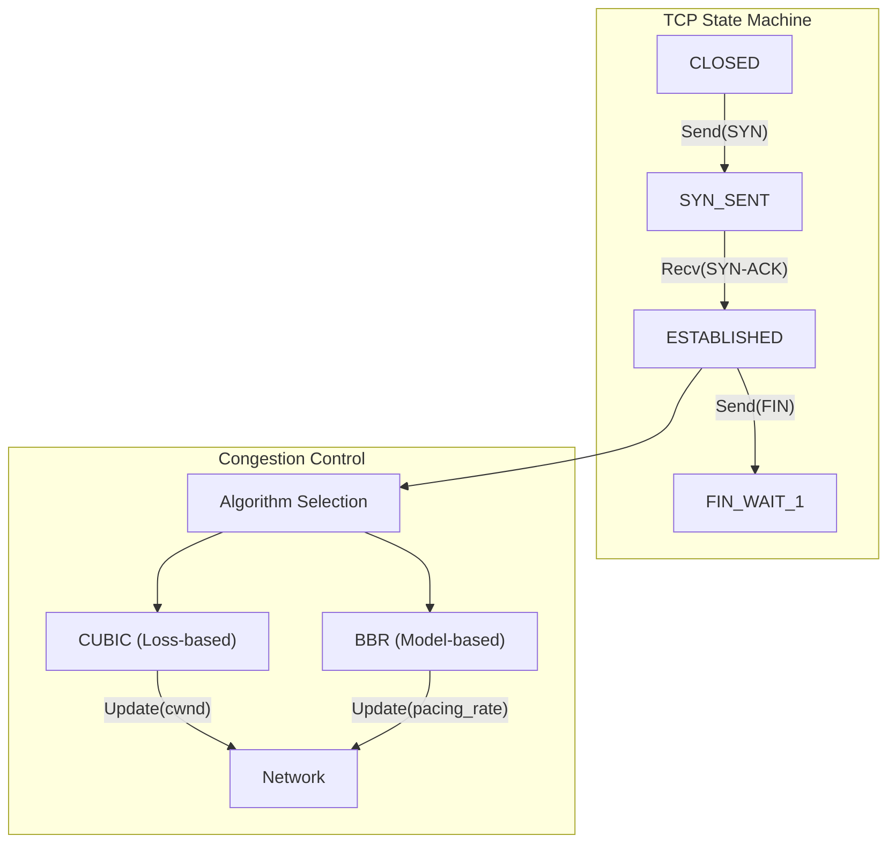

# Network Protocols Mechanics

## TCP State Machine
TCP is a connection-oriented, reliable transport protocol driven by a complex state machine defined in RFC 793.
- **Connection Establishment:** Transitions through `SYN_SENT`, `SYN_RCVD`, to `ESTABLISHED` via the 3-way handshake.
- **Data Transfer:** In `ESTABLISHED`, sequencing and ACKs manage reliability.
- **Teardown:** Involves `FIN_WAIT_1`, `FIN_WAIT_2`, `TIME_WAIT`, `CLOSE_WAIT`, `LAST_ACK`. `TIME_WAIT` ensures delayed packets are not mistakenly delivered to a new incarnation of the connection.

## Congestion Control Algorithms
Congestion control modulates the Congestion Window (`cwnd`) to avoid network collapse.
- **Loss-based (Cubic):** Uses a cubic function of time since the last congestion event to dictate `cwnd` growth. It aggressively probes for bandwidth, resulting in a convex growth profile that scales well in high-BDP (Bandwidth-Delay Product) networks. Relies on packet loss as the primary congestion signal.
- **Delay-based (BBR - Bottleneck Bandwidth and Round-trip propagation time):** Models the network path. It continuously measures the maximum delivery rate (Bottleneck Bandwidth) and minimum RTT. BBR controls sending rate to match the estimated BDP, minimizing queue buildup (bufferbloat) and operating near the optimal Kleinrock point, rather than reacting solely to loss.

