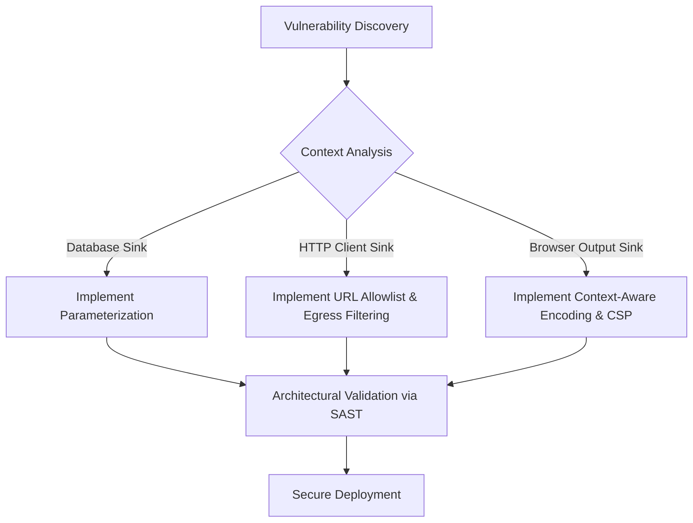

# OWASP Web Security & Vulnerability Mechanics

As an application security analyst, you must understand the theoretical underpinnings of web vulnerabilities to accurately identify them through static code analysis (SAST) and remediate them architecturally.

## 1. Theoretical Mechanics of Injection Flaws

Injection vulnerabilities (SQLi, NoSQLi, OS Command Injection) occur when untrusted data is sent to an interpreter as part of a command or query. The core theoretical failure is the **lack of separation between control plane (syntax) and data plane**.

- **Identification via SAST**: Look for sinks (e.g., `execute()`, `exec()`, `eval()`) where the data flow graph shows input from an untrusted source without intervening sanitization or parameterization nodes.
- **Architectural Remediation**: The definitive defense is the adoption of parameterized interfaces (e.g., Prepared Statements) or Object-Relational Mapping (ORM) frameworks that strictly enforce this separation by treating all input purely as literal values.

## 2. Server-Side Request Forgery (SSRF)

SSRF arises when a web application fetches a remote resource without validating the user-supplied URL. It exploits the trust relationship the server has with its internal network.

- **Identification via SAST**: Trace tainted input to HTTP client sinks (e.g., `requests.get()`, `cURL`). 
- **Architectural Remediation**: 
  - **Network Layer**: Segment the application's network access using strict egress firewalls.
  - **Application Layer**: Implement an allowlist of permitted domains/IPs. Never trust user-provided URLs to access internal metadata services (e.g., AWS IMDS, `169.254.169.254`).

## 3. Cross-Site Scripting (XSS)

XSS is the result of reflecting untrusted data in a web browser without proper contextual output encoding, allowing the execution of arbitrary JavaScript within the victim's session context.

- **Mechanics**: DOM-based XSS involves data flowing from a `source` (e.g., `location.hash`) to a `sink` (e.g., `innerHTML`) purely client-side. Reflected/Stored XSS involves the server echoing data into the HTML response.
- **Architectural Remediation**: 
  - **Context-Aware Encoding**: Apply HTML entity encoding, JavaScript encoding, or URL encoding depending on where the data is placed.
  - **Content Security Policy (CSP)**: Deploy strict CSP headers (`default-src 'self'`) to mitigate the impact by restricting where scripts can be loaded from and preventing inline script execution.

## Remediation Workflow

