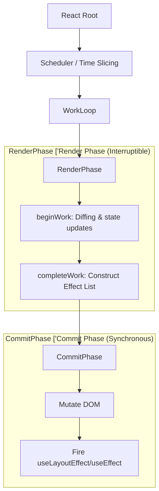

# React Fiber Architecture: Core Mechanics & Reconciliation

React Fiber is the reimplementation of React's core algorithm. It is a complete rewrite of the stack renderer, introducing a virtual stack frame model that enables cooperative scheduling, concurrent rendering, and incremental reconciliation.

## 1. The Fiber Node Model

At its core, a Fiber is a JavaScript object that represents a unit of work. It is the data structure that represents a React element in the reconciliation process.

Unlike the recursive call stack in the legacy React reconciler, Fiber nodes form a linked list (technically a tree represented as a singly linked list with child, sibling, and return pointers). This structure allows the reconciliation process to be paused, resumed, or aborted.

```javascript
type Fiber = {
  // Instance Identity
  tag: WorkTag,
  key: null | string,
  elementType: any,
  type: any,
  stateNode: any, // The DOM element or class instance

  // Fiber Tree Pointers
  return: Fiber | null,
  child: Fiber | null,
  sibling: Fiber | null,
  index: number,

  // Effects & Reconciliation
  pendingProps: any, 
  memoizedProps: any,
  updateQueue: mixed,
  memoizedState: any,
  
  // Effect linked list
  effectTag: SideEffectTag,
  nextEffect: Fiber | null,
  firstEffect: Fiber | null,
  lastEffect: Fiber | null,

  // Alternate for double buffering
  alternate: Fiber | null,
};
```

## 2. Rendering Phases: Render vs. Commit

The React reconciliation process is strictly divided into two distinct phases:

### Phase 1: The Render Phase (Interruptible)
The Render phase traverses the Fiber tree, calling `beginWork` and `completeWork`. It computes the changes (effects) required for the DOM. Because this phase does not mutate the DOM, it is purely mathematical and can be interrupted, discarded, or deprioritized.
- **Work Loop:** React utilizes a `workLoop` that continuously checks `shouldYield()` to allow the main thread to handle high-priority events (e.g., user inputs, animations).
- **Output:** The output is a list of side-effects (the Effect List), attached to the root Fiber.

### Phase 2: The Commit Phase (Uninterruptible)
The Commit phase takes the generated Effect List and applies the mutations to the DOM (or other host environment) synchronously. It cannot be interrupted, ensuring UI consistency.
- It invokes lifecycle methods (`componentDidMount`, `componentDidUpdate`) and `useEffect` / `useLayoutEffect` callbacks.

## 3. Concurrent Mode & Cooperative Scheduling

Concurrent mode fundamentally changes how React interacts with the JavaScript event loop. It leverages `requestIdleCallback` (or a polyfill via MessageChannel) to slice the render phase into chunks (time-slicing).

The scheduler assigns priorities to updates:
- **Immediate Priority:** Discrete user interactions (clicks, keystrokes).
- **User-Blocking Priority:** Hover, layout updates.
- **Normal Priority:** Network responses.
- **Low/Idle Priority:** Background data syncing.

## 4. Architectural Diagram


