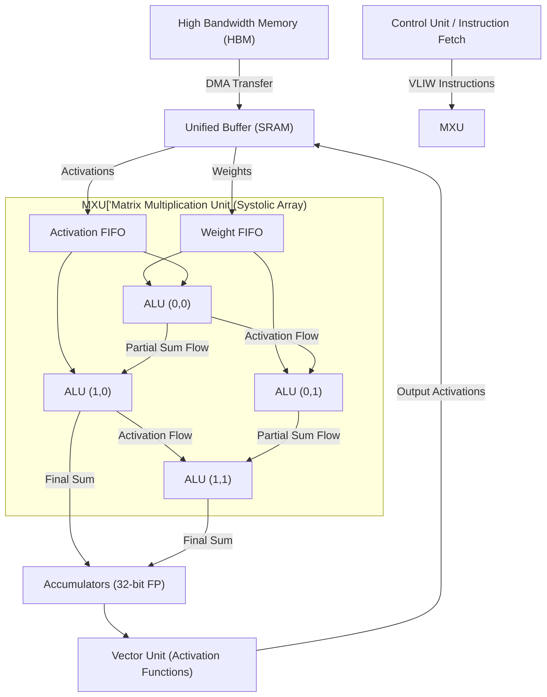

# TPU Systolic Arrays: Algorithmic Silicon Design

## Theoretical Foundations

Google's Tensor Processing Unit (TPU) diverges fundamentally from NVIDIA's Single Instruction, Multiple Threads (SIMT) architecture. While SIMT relies on massive multi-threading and immense register file bandwidth to mask memory latency, the TPU leverages a spatial architecture known as a Systolic Array.

In a Systolic Array, data flows synchronously across a tightly coupled grid of Arithmetic Logic Units (ALUs). The core principle is localized data reuse: once a weight or activation is loaded from Static RAM (SRAM) into the array, it propagates bidirectionally through adjacent ALUs over consecutive clock cycles, participating in multiple multiply-accumulate (MAC) operations before exiting the pipeline.

## Silicon Datapath: Matrix Multiplication Unit (MXU)

The MXU is the computational heart of the TPU. It executes dense matrix multiplications without the Von Neumann bottleneck of reading/writing intermediate results to a centralized register file.

1.  **Weight Preload**: Matrix B (Weights) is loaded from High Bandwidth Memory (HBM) into the Unified Buffer (SRAM), then streamed into the MXU grid and held stationary in the local registers of each ALU cell.
2.  **Activation Streaming**: Matrix A (Activations) streams from the Unified Buffer into the left edge of the Systolic Array.
3.  **Wavefront Computation**: On clock cycle `t`, an ALU computes `A_{i,k} * B_{k,j} + PartialSum`, then passes `A` rightward and the `PartialSum` downward for cycle `t+1`.
4.  **Accumulation**: The partial sums cascade vertically down the columns. The final vector of accumulated sums emerges from the bottom of the array into the Accumulators.

By architecting the silicon to match the data dependency graph of matrix multiplication, the MXU achieves near-theoretical peak FLOP/s with drastically reduced instruction fetch and register access overhead compared to general-purpose GPU streaming multiprocessors.

## Mermaid Flowchart: TPU Systolic Array Datapath

