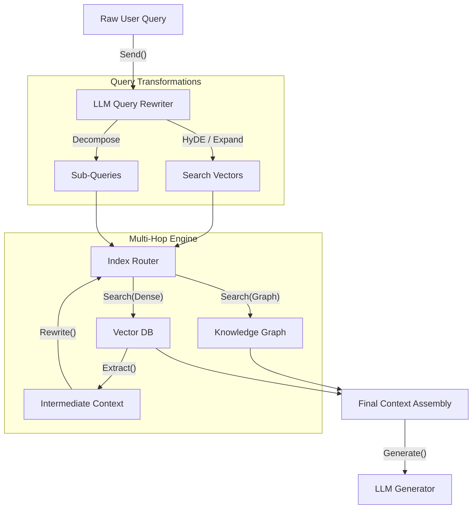

# RAG Design Mechanics

## Multi-Hop Retrieval architecture
Complex queries often require assembling facts scattered across multiple documents. Multi-hop retrieval breaks down a compositional query into sub-queries.
- **Iterative Retrieval:** The system retrieves an initial document, extracts an entity/fact, and formulates a new search vector to traverse a knowledge graph or vector space until the termination condition is met.
- **Graph-based RAG:** Leverages knowledge graphs (e.g., Neo4j) where LLMs generate Cypher queries to traverse edges, providing exact relational context before falling back to dense vector similarity search (HNSW, IVF-PQ).

## Query Rewriting via LLM
Raw user queries are often heavily underspecified, containing lexical ambiguities or missing context.
- **Query Expansion/HyDE (Hypothetical Document Embeddings):** An LLM generates a hypothetical, hallucinated answer to the query. The embedding of this pseudo-document is then used to search the vector database, bridging the semantic gap between questions and answers.
- **Query Decomposition:** The LLM rewrites the single input into $N$ distinct queries targeting different facets of the problem.
- **Routing:** A small classifier or LLM router directs the rewritten queries to specific indices (e.g., tabular SQL DB, dense vector index, BM25 keyword index).

