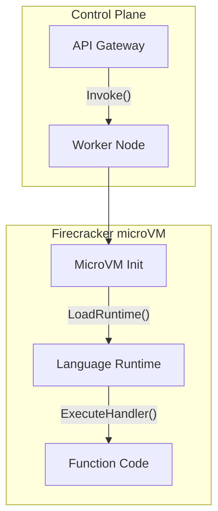

# AWS Serverless: Deep Dive into Lambda and Firecracker

AWS Lambda abstracts infrastructure, but under the hood, it relies heavily on Firecracker microVMs. Firecracker uses the KVM (Kernel-based Virtual Machine) to provision and manage secure, lightweight microVMs. A microVM has a minimal device model, stripping away unnecessary hardware emulation to achieve boot times of <125ms and a memory footprint of <5MB per VM. 

When a Lambda function is invoked for the first time (a cold start), the Firecracker hypervisor allocates a new microVM. The control plane downloads the function package, initializes the language runtime, and executes the user's initialization code.

