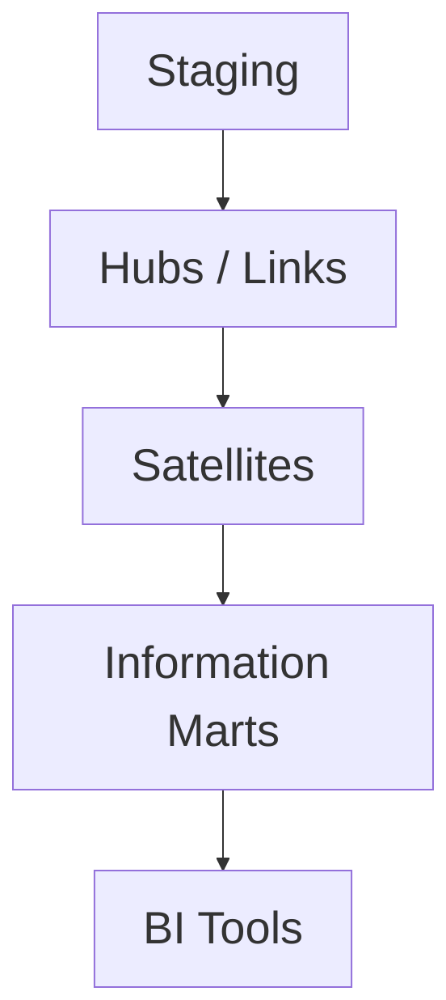

# Modeling Optimization Strategies
## 1. Deep Architectural Analysis
Data Vault 2.0 implementations combined with dbt require strict separation of compute and storage. Hubs, Links, and Satellites reduce update anomalies, while hash keys enable massively parallel loading in MPP architectures like Snowflake.

## 2. System Architecture


## 3. Mathematical Formulas
SCD Type 2 Growth modeling:
$$ V_t = V_0 + \sum_{i=1}^{t} (\alpha \cdot N_i) \cdot (1 + \epsilon) $$
Where $\alpha$ is the mutation rate and $\epsilon$ is the fragmentation overhead.

## 4. Code Implementations

### PySpark
```python
def generate_hash_key(df):
    from pyspark.sql.functions import sha2, concat_ws
    return df.withColumn("hub_key", sha2(concat_ws("||", "business_key"), 256))
```

### SQL (dbt)
```sql
{{ config(materialized='incremental') }}
SELECT md5(customer_id) as customer_hk, *
FROM {{ ref('stg_customers') }}

  WHERE updated_at > (SELECT max(updated_at) FROM {{ this }})

```

### Java
```java
// Java UDF for custom hashing
public String eval(String key) {
    return DigestUtils.sha256Hex(key.trim().toUpperCase());
}
```
