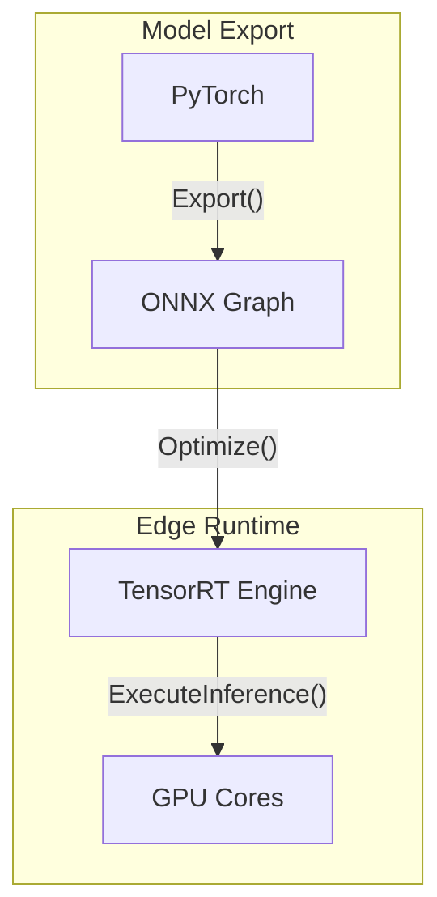

# Edge AI: TensorRT and ONNX

Deploying deep learning models on edge devices with limited compute requires rigorous optimization. NVIDIA TensorRT performs graph optimizations, layer fusion (e.g., merging convolution, bias, and ReLU layers), and precision calibration (quantizing FP32 weights to FP16 or INT8 without significant accuracy loss). 

ONNX (Open Neural Network Exchange) provides an interoperable format. The ONNX Runtime acts as the execution engine, utilizing execution providers (like TensorRT or CUDA) to map model operators to hardware-accelerated kernels.

