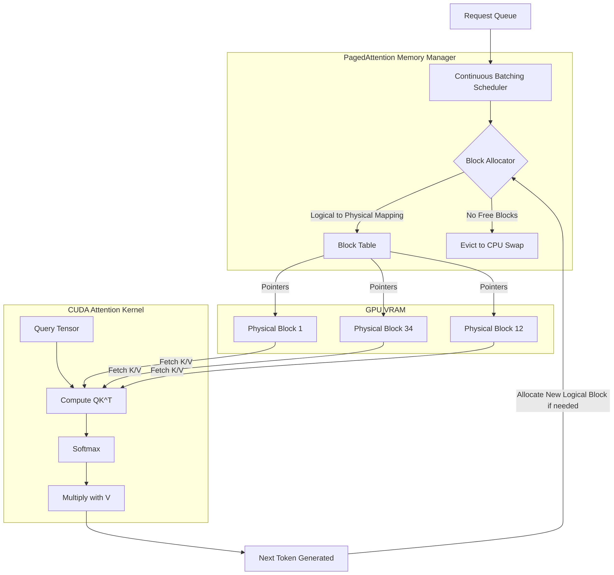

# KV Cache and Attention Mechanisms: PagedAttention and vLLM

## 1. The Bottleneck of Autoregressive Decoding

During autoregressive generation, Transformers exhibit quadratic time and linear space complexity with respect to sequence length. To prevent recomputing the Key ($K$) and Value ($V$) tensors for preceding tokens at each generation step, the KV cache is utilized.
- **Static Allocation Issues:** Naive implementations pre-allocate contiguous GPU memory based on the theoretical maximum sequence length. Due to unpredictable generation lengths, this causes internal fragmentation (reserved but unused memory) and external fragmentation, wasting up to 80% of VRAM capacity and heavily restricting concurrent request batching.

## 2. PagedAttention Architecture

PagedAttention directly maps operating system virtual memory paging concepts to GPU tensor memory management.
- **Logical vs. Physical Memory:** The KV cache for a sequence is represented as a contiguous logical sequence of blocks. However, the physical memory on the GPU is divided into fixed-size non-contiguous physical blocks (e.g., 16 or 32 tokens per block).
- **Block Tables:** vLLM maintains a block table mapping logical blocks to physical block indices. During the attention computation, the CUDA kernel fetches physical blocks via pointers located in the block table, eliminating the need for contiguous allocation.
- **Zero-Waste Allocation:** Memory is allocated dynamically on a per-block basis as generation proceeds, eliminating internal fragmentation (aside from the final partially-filled block).

## 3. GPU Memory Layout and Optimization in vLLM

### 3.1 Memory Partitioning
Upon initialization, vLLM profiles the model to determine static VRAM requirements (weights, activation buffers). The remaining VRAM is aggressively partitioned into physical KV blocks.
- **Cache Block Pool:** A centralized allocator manages physical blocks. When a request is queued, vLLM only needs to ensure sufficient logical blocks exist in the pool for the current decoding step.

### 3.2 Advanced Paging Operations
- **Copy-on-Write (CoW):** When multiple generation requests share a common prompt (e.g., few-shot prompting, parallel sampling), their logical block tables point to the identical physical prompt blocks. If a sequence modifies a block (generation diverges), CoW triggers a duplication of the physical block.
- **Swapping and Preemption:** If VRAM is exhausted during generation, vLLM employs a preemption strategy. It evicts physical KV blocks of lower-priority sequences to CPU RAM (swap out) or aborts and recomputes them later. The memory manager dictates tensor transfers across the PCIe bus seamlessly.

## 4. Decoding Execution Topology

