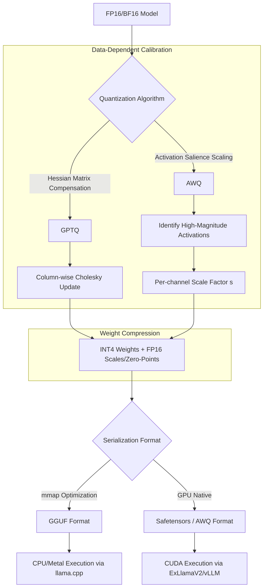

# Model Quantization Mechanics: Precision Reduction and Weight Formatting

## 1. Mathematical Mechanics of Quantization (FP16 to INT4)

Quantization reduces the precision of model weights (and sometimes activations) from 16-bit floating-point (FP16/BF16) to lower bit-widths (e.g., INT4, INT8).
- **Affine Quantization:** Given a tensor of weights $W$, quantization operates via a scaling factor $S$ and a zero-point $Z$.
  $$ W_{quant} = \text{round}\left(\frac{W}{S}\right) + Z $$
  $$ W_{dequant} = S \times (W_{quant} - Z) $$
- **Group-wise Quantization:** Applying a single scale/zero-point across a massive weight matrix leads to severe outlier degradation. Weights are grouped into blocks (e.g., $g=128$), and distinct $S$ and $Z$ are computed per group, mitigating the impact of anomalous activation/weight magnitudes.

## 2. Advanced Quantization Algorithms

### 2.1 GPTQ (Generative Pre-trained Transformer Quantization)
GPTQ is an Optimal Brain Quantization (OBQ) derivative based on approximate second-order Hessian information.
- **Objective:** Minimize the layer-wise reconstruction error $\lVert WX - \hat{W}X \rVert_2^2$.
- **Mechanics:** GPTQ quantizes weights sequentially (column by column). When a weight is quantized, the quantization error is compensated by updating all remaining unquantized weights in the same row. It utilizes a Cholesky decomposition of the inverse Hessian matrix $(H^{-1})$ to compute optimal updates efficiently, enabling the quantization of massive matrices (e.g., 175B parameters) in hours.

### 2.2 AWQ (Activation-aware Weight Quantization)
AWQ preserves performance by avoiding the quantization of "salient" weights (typically ~1% of weights).
- **Salience Identification:** Weights are deemed salient not by their own magnitude, but by the magnitude of their corresponding input activations ($X$).
- **Scale Transformation:** Instead of mixing precision (which is hardware inefficient), AWQ applies a per-channel scaling factor $s$ to multiply the salient weights and divide the corresponding input activations. This artificially reduces the relative quantization error for these critical weights without altering the mathematical output of the layer.

## 3. Storage and Execution Formats: GGUF

GGUF (GPT-Generated Unified Format) supersedes GGML as the standard for CPU/CPU+GPU hybrid inference.
- **Memory Mapping (mmap):** GGUF is designed for direct memory-mapping. The entire file (metadata + tensor data) can be mapped into RAM without parsing overhead.
- **Tensor Layout:** GGUF stores tensors with varying quantization schemes (e.g., `Q4_K_M`, where K denotes k-quants). Tensors are block-quantized, often utilizing a multi-level quantization approach (e.g., super-blocks containing scales, which are themselves quantized).
- **Extensibility:** Utilizes a robust key-value metadata store allowing arbitrary hyperparameter injection (RoPE scaling factors, EOS token IDs) preventing the need for external configuration files.

## 4. Quantization Topology

