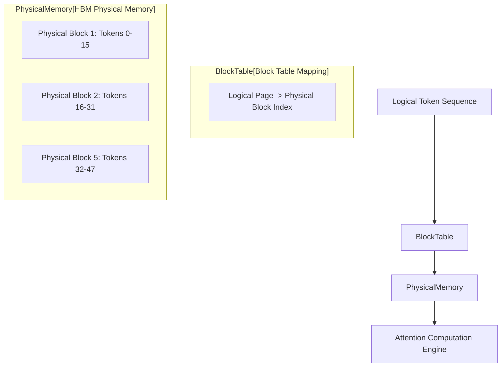

# PagedAttention: OS Paging for LLM Inference

In autoregressive LLM inference (e.g., vLLM), the Key-Value (KV) cache consumes immense HBM capacity and grows dynamically. Traditional contiguous memory allocation leads to severe fragmentation (internal, external, and pre-allocation waste), often wasting 60-80% of KV cache memory.

## OS-Inspired Virtual Memory
PagedAttention adopts the operating system concept of virtual memory and paging to manage the KV cache.
- **Blocks/Pages**: The KV cache is divided into fixed-size blocks (e.g., storing KV vectors for 16 tokens).
- **Non-Contiguous Allocation**: Blocks do not need to be contiguous in physical memory. A block table maps logical token positions to physical block indices.

## Memory Fragmentation Elimination
1. **Zero External Fragmentation**: All physical blocks are uniform in size; any free block can serve any request.
2. **Minimal Internal Fragmentation**: Only the final block of a sequence may be partially unfilled.
3. **Dynamic Allocation**: Memory is allocated strictly on-demand per generation step, eliminating pre-allocation waste.

## Memory Sharing
Because logical-to-physical mapping is abstracted, multiple sequences (e.g., beam search, parallel sampling) can safely share physical pages. Copy-on-Write (CoW) is triggered only when a sequence diverges.

## Architecture Data Flow

