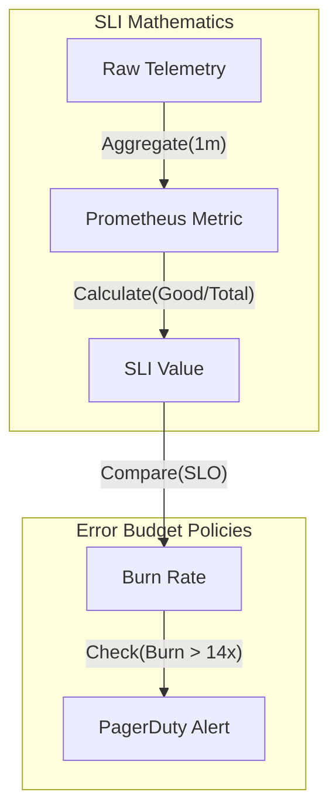

# SLI/SLO Management: Under the Hood

## Mathematical Modeling of SLIs
Service Level Indicators (SLIs) must be quantifiable fractions of good events over total events.
- **Availability SLI**: $SLI_{avail} = \frac{\text{Successful Requests}}{\text{Total Valid Requests}}$
- **Latency SLI**: $SLI_{latency} = \frac{\text{Requests } < 200ms}{\text{Total Requests}}$
- **Continuous Aggregation**: SLIs are typically evaluated over rolling windows (e.g., 28 days) using integration of time-series metrics.

## Error Budget Policies
An error budget represents the allowed unreliability: $1 - \text{SLO}$.
- **Burn Rate Alerts**: Instead of absolute thresholds, alerting is based on the rate of budget consumption. A burn rate of 1 means the budget will be exactly exhausted in the 28-day window.
- **Consequence Automation**: If the 28-day budget falls below 0, CI/CD pipelines are programmatically frozen to enforce reliability over feature velocity.
