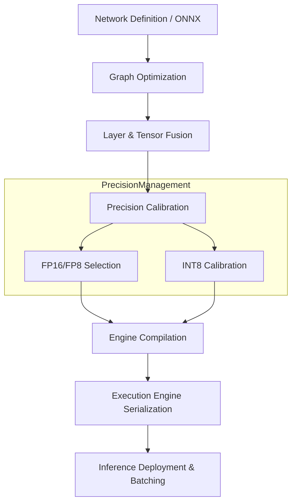

# TensorRT Inference Architecture

## Core Philosophy: Ruthless Graph Compilation
TensorRT (TRT) transforms neural networks into hyper-optimized, platform-specific engines. The objective is to maximize throughput and minimize latency through aggressive graph-level transformations and reduced precision numerics. The AI agent must approach TRT not as a library, but as an adversarial compiler that strips away abstraction overheads.

## Layer and Tensor Fusion
TRT intrinsically merges sequential operations (e.g., Conv+Bias+ReLU or MatMul+Add+GeLU) into monolithic kernels. The agent must architect networks that exploit known fusion patterns. Avoid idiosyncratic topologies that fragment the execution graph, causing excessive kernel launch overhead and intermediate VRAM materialization.

## Quantization: FP16, INT8, and FP8
Deploying FP32 is computationally negligent.
- **PTQ (Post-Training Quantization)**: Utilize calibration datasets to establish activation dynamic ranges. Agents must ensure calibration data accurately represents the operational distribution.
- **QAT (Quantization-Aware Training)**: Embed fake-quantization nodes during training to learn scale/zero-point parameters directly, yielding superior accuracy at ultra-low precision (INT8/INT4).
- **KV Cache Quantization**: For LLMs, quantizing the KV cache to FP8 or INT8 is non-negotiable to overcome memory-bandwidth bottlenecks during autoregressive decoding.

## Memory Bandwidth & LLM Decoding
Large Language Models are uniformly memory-bandwidth bound during generation. Optimization mandates maximizing KV cache locality and utilizing Inflight Batching (Continuous Batching) to saturate SMs while amortizing memory fetches across request queues. PagedAttention paradigms should be coupled with TRT-LLM to eliminate memory fragmentation.

