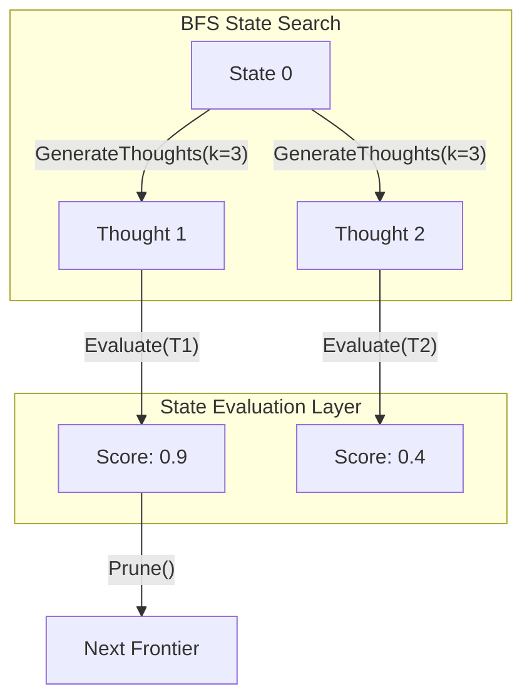

# Tree of Thoughts (ToT) Mechanics

Tree of Thoughts (ToT) generalizes the concept of prompt engineering by framing LLM decoding as a rigorous search over a tree where nodes represent partial solutions (thoughts). This enables the LLM to perform deliberate reasoning through exploration and backtracking.

## State Space Formulation
The problem is formulated as a tuple $(S, G, E, V, \text{Search})$, where $S$ is the state space, $G$ is the generator of thoughts, $E$ is the evaluator, and $V$ is the validation criteria.

### Breadth-First Search (BFS) Implementation
In ToT BFS, we maintain a frontier of size $b$. At step $k$, we expand each of the $b$ states by generating $k$ new thoughts.

## State Evaluation Mechanisms
Evaluating states involves prompting the LLM to assess the viability of a partial solution.
- **Value Prompting**: The LLM assigns a scalar score (e.g., 1-10) or classification (sure, likely, impossible).
- **Voting**: Multiple LLM instances vote on the best thought among candidates.
