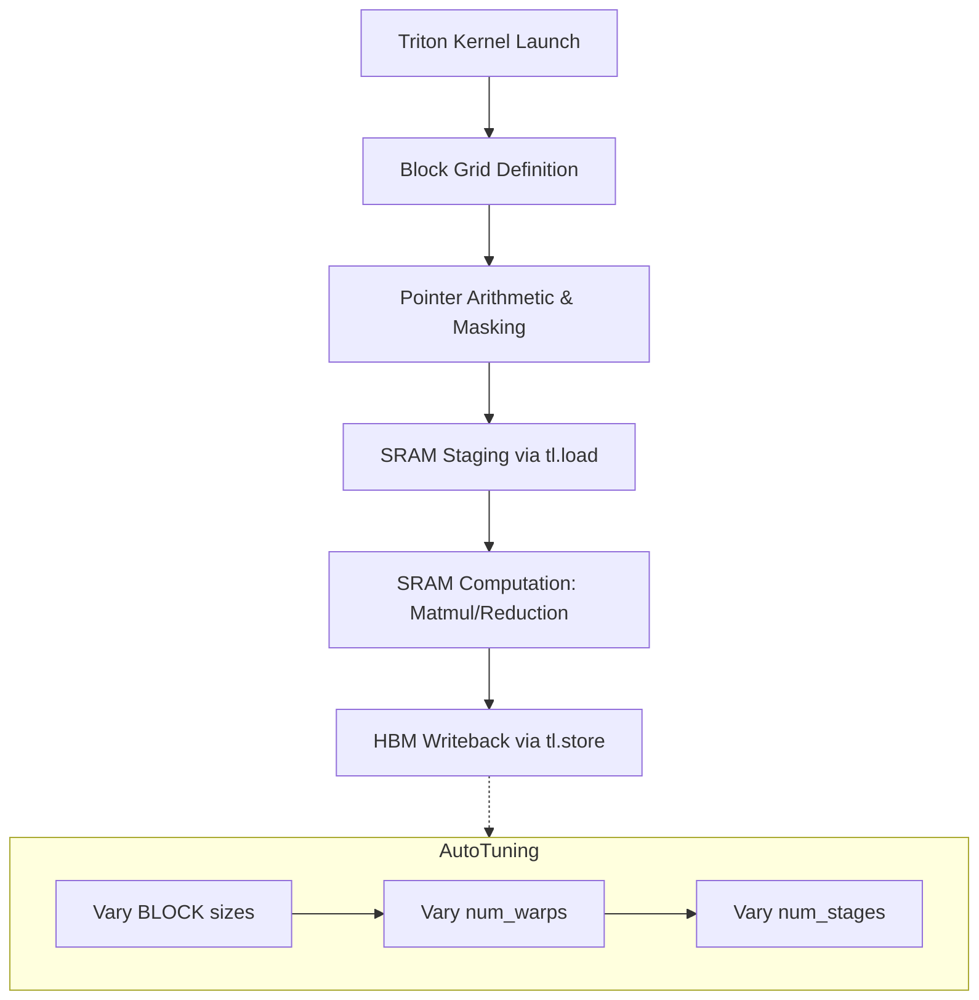

# Triton Kernel Optimization Mastery

## Core Philosophy: Block-Level Hardware Symphony
OpenAI Triton abstracts the CUDA threading hierarchy into block-level operations, demanding a paradigm shift from thread-centric to block-centric programming. Execution hinges on maximizing Streaming Multiprocessor (SM) occupancy, exploiting SRAM (Shared Memory) locality, and ruthlessly minimizing High Bandwidth Memory (HBM) latency. You must conceptualize execution as tiles of memory flowing deterministically through the memory hierarchy.

## The Memory Hierarchy & Pointer Arithmetic
Do not rely on naive broadcasting. Compute memory pointers explicitly for block geometries. HBM reads/writes dictate kernel performance; arithmetic intensity must hide memory latency.
- **Coalesced Access**: Ensure thread blocks access contiguous memory chunks.
- **SRAM Staging**: Stage data in Shared Memory via `tl.load` before arithmetic.
- **Tile Sizing**: Block sizes must align with hardware warp boundaries (typically 32).

## Auto-Tuning Execution
Kernels are useless without hardware-specific parameterization. Employ `@triton.autotune` decorators relentlessly to search the combinatorial space of block dimensions (`BLOCK_M`, `BLOCK_N`, `BLOCK_K`), `num_warps`, and `num_stages`. Optimal configurations are non-linear; empirical search is mandatory.

## Flash Attention Paradigm
Implementing attention demands block-level softmax formulations (e.g., FlashAttention). You must fuse the exponential sum accumulations iteratively over block loops to avoid HBM materialization of the $N \times N$ attention matrix.

