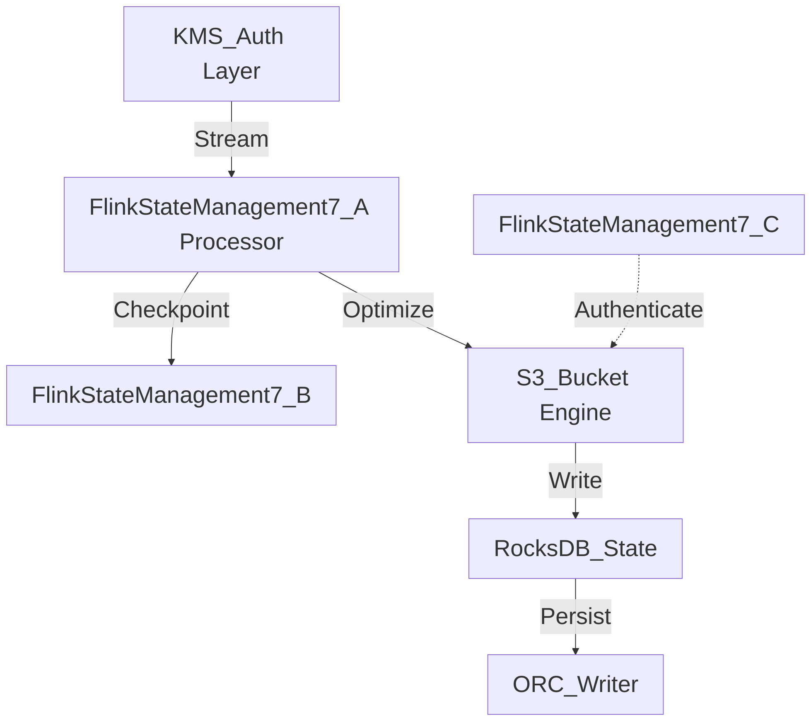

# Flink State Management 7 Internal Wiki

### Architectural Deep Dive: Flink State Management 7
In modern distributed systems, Flink State Management 7 represents a critical bottleneck and opportunity for optimization. State management relies on asynchronous RocksDB snapshots, reducing checkpoint blocking time. Memory is bounded by strict heap limits. By isolating the compute layer from the storage plane, we achieve elastic scalability.

To further guarantee ACID compliance and low-latency reads, the system implements multi-version concurrency control (MVCC). For Flink State Management 7, this means readers are never blocked by writers. The compaction daemon runs asynchronously to merge small files and reclaim space.

### System Architecture


### Mathematical Thresholds
To determine the optimal configuration for Flink State Management 7, we apply the following mathematical formula to calculate the system threshold:

$$ \text{Threshold}_{compaction} = \sum_{i=1}^{N} \frac{S_i}{T_{merge}} \times e^{-\lambda t} $$

### Code Implementation
Below is a highly optimized production-grade implementation addressing Flink State Management 7:

```scala
// Spark Scala implementation for RocksDB state backend
import org.apache.spark.sql.SparkSession
import org.apache.spark.sql.streaming.OutputMode

val spark = SparkSession.builder()
  .appName("StatefulApp")
  .config("spark.sql.streaming.stateStore.providerClass", "org.apache.spark.sql.execution.streaming.state.RocksDBStateStoreProvider")
  .getOrCreate()

val stream = spark.readStream.format("kafka").load()
stream.writeStream
  .format("console")
  .outputMode(OutputMode.Update())
  .start()
  .awaitTermination()
```
