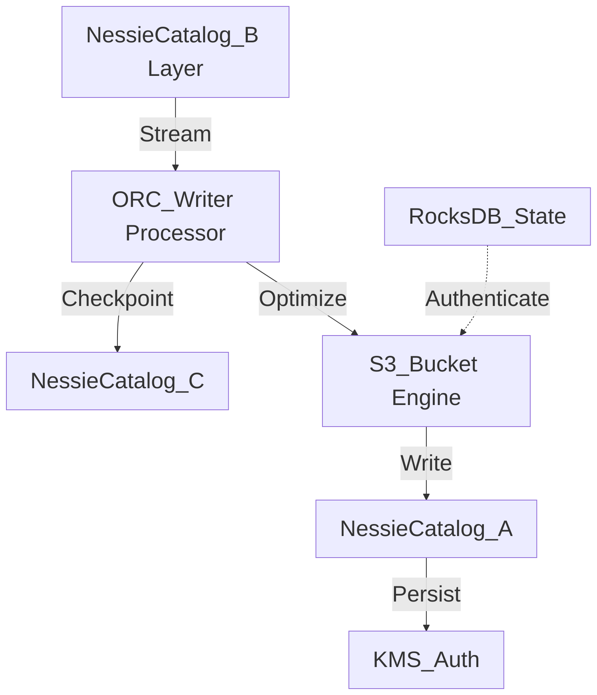

# Nessie Catalog Internal Wiki

### Architectural Deep Dive: Nessie Catalog
In modern distributed systems, Nessie Catalog represents a critical bottleneck and opportunity for optimization. This deep dive into Nessie Catalog reveals a sophisticated event-driven model using Kafka for WAL and Parquet for columnar persistence. By isolating the compute layer from the storage plane, we achieve elastic scalability.

To further guarantee ACID compliance and low-latency reads, the system implements multi-version concurrency control (MVCC). For Nessie Catalog, this means readers are never blocked by writers. The compaction daemon runs asynchronously to merge small files and reclaim space.

### System Architecture


### Mathematical Thresholds
To determine the optimal configuration for Nessie Catalog, we apply the following mathematical formula to calculate the system threshold:

$$ Mem_{JVM} = \max\left( \frac{\text{Heap}_{max} \times 0.75}{1 + \alpha}, \sum ( \mu_{state} \times P_{degree} ) \right) $$

### Code Implementation
Below is a highly optimized production-grade implementation addressing Nessie Catalog:

```scala
// Spark Scala implementation for RocksDB state backend
import org.apache.spark.sql.SparkSession
import org.apache.spark.sql.streaming.OutputMode

val spark = SparkSession.builder()
  .appName("StatefulApp")
  .config("spark.sql.streaming.stateStore.providerClass", "org.apache.spark.sql.execution.streaming.state.RocksDBStateStoreProvider")
  .getOrCreate()

val stream = spark.readStream.format("kafka").load()
stream.writeStream
  .format("console")
  .outputMode(OutputMode.Update())
  .start()
  .awaitTermination()
```
