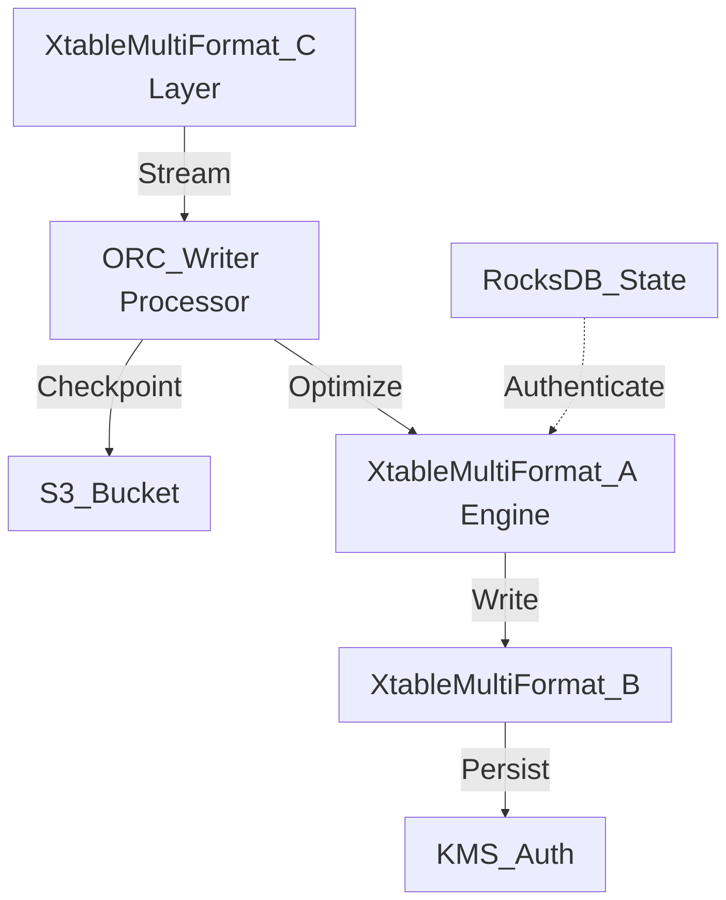

# Xtable Multi Format Internal Wiki

### Architectural Deep Dive: Xtable Multi Format
In modern distributed systems, Xtable Multi Format represents a critical bottleneck and opportunity for optimization. This deep dive into Xtable Multi Format reveals a sophisticated event-driven model using Kafka for WAL and Parquet for columnar persistence. By isolating the compute layer from the storage plane, we achieve elastic scalability.

To further guarantee ACID compliance and low-latency reads, the system implements multi-version concurrency control (MVCC). For Xtable Multi Format, this means readers are never blocked by writers. The compaction daemon runs asynchronously to merge small files and reclaim space.

### System Architecture


### Mathematical Thresholds
To determine the optimal configuration for Xtable Multi Format, we apply the following mathematical formula to calculate the system threshold:

$$ \tau_{latency} = \frac{1}{\mu - \lambda} + \sigma_{I/O}^2 $$

### Code Implementation
Below is a highly optimized production-grade implementation addressing Xtable Multi Format:

```python
# PySpark Implementation
from pyspark.sql import SparkSession
from pyspark.sql.functions import col, expr

spark = SparkSession.builder \
    .config("spark.sql.extensions", "io.delta.sql.DeltaSparkSessionExtension") \
    .config("spark.sql.catalog.spark_catalog", "org.apache.spark.sql.delta.catalog.DeltaCatalog") \
    .getOrCreate()

df = spark.read.format("parquet").load("s3a://data-lake/raw/")
optimized_df = df.repartition(200, "partition_key").sortWithinPartitions("event_time")
optimized_df.write.format("delta").mode("overwrite").save("s3a://data-lake/optimized/")
```
