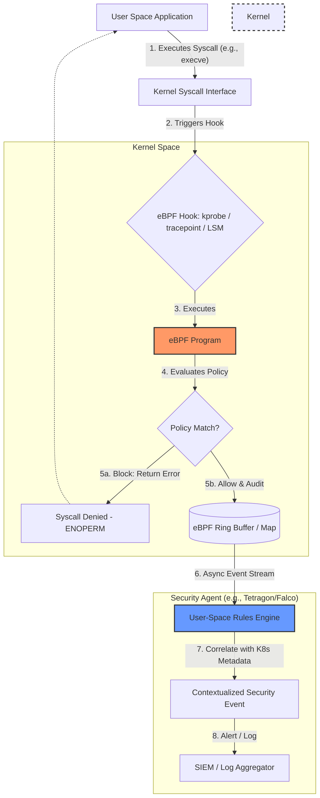

# eBPF-Based Threat Detection and Kernel Instrumentation

Extended Berkeley Packet Filter (eBPF) revolutionized Linux observability and security by allowing sandboxed programs to run within the kernel space without requiring kernel module compilation or system reboots. This is critical for low-overhead, high-fidelity threat detection.

## eBPF Architecture

eBPF programs are event-driven. They attach to specific kernel hooks (kprobes, tracepoints, network events). When the hook is triggered, the eBPF program executes.

1.  **Compilation**: eBPF programs (typically written in restricted C) are compiled into eBPF bytecode using LLVM/Clang.
2.  **Loading**: A user-space application (via the `bpf()` syscall) loads the bytecode into the kernel.
3.  **Verification**: The kernel's eBPF verifier analyzes the bytecode to ensure it's safe (no infinite loops, memory bounds checking, restricted helper functions).
4.  **JIT Compilation**: The bytecode is Just-In-Time (JIT) compiled into native machine code for performance.
5.  **Execution & Data Export**: The program runs contextually. It shares data with user-space via eBPF Maps (hash tables, arrays, ring buffers).

## Intercepting Malicious Syscalls

Syscalls are the interface between user-space and kernel-space. Monitoring them is fundamental to detecting malicious behavior (e.g., `execve` for process execution, `ptrace` for memory injection, `bpf` for illicit eBPF loading).

*   **kprobes/kretprobes**: Allow dynamic instrumentation of kernel function entry (`kprobe`) and exit (`kretprobe`). Useful for inspecting arguments passed to syscall handlers (e.g., `sys_execve`).
*   **Tracepoints**: Static, defined hooks placed by kernel developers in the source code. They are more stable across kernel versions than kprobes.
*   **LSM (Linux Security Modules) BPF**: Allows eBPF programs to attach to LSM hooks (like those used by SELinux/AppArmor), enabling not just auditing, but active blocking (returning an error code to the syscall) without writing a traditional LSM.

## Falco: Behavioral Threat Detection

Falco acts as an intrusion detection system for cloud-native environments.
*   **Mechanism**: Originally relied on a kernel module or eBPF probe to capture system calls. It streams these events (contextualized with container/Kubernetes metadata) to a user-space rules engine.
*   **Rules**: Uses a domain-specific language (YAML) to define anomalous behavior (e.g., "A shell was spawned inside a container").
*   **Limitation**: Historically focused on detection (alerting) rather than enforcement (blocking), though integrations exist for response. It captures events asynchronously, meaning a malicious action might complete before the alert is processed.

## Tetragon: Transparent Kernel Enforcement

Tetragon (by Isovalent/Cilium) leverages advanced eBPF capabilities for both deep observability and inline enforcement.
*   **Mechanism**: Uses eBPF programs deeply integrated into kernel subsystems. It correlates network, process, and file access events.
*   **Synchronous Enforcement**: Tetragon can use eBPF to synchronously block actions. If a policy dictates that a binary should not execute, the eBPF program attached to the relevant kernel hook can return a failure *before* the execution proceeds.
*   **In-Kernel Filtering**: Unlike older tools that send massive amounts of raw syscall data to user-space for filtering, Tetragon performs complex filtering directly in the kernel via eBPF, drastically reducing overhead.

## Architecture Mapping

