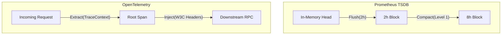

# Observability & Scaling: Core Mechanics

## Prometheus TSDB Compaction
Prometheus utilizes a custom Time Series Database (TSDB) optimized for fast ingestion and querying.
- **Head Block**: Active data is stored in memory and a Write-Ahead Log (WAL).
- **Compaction**: Persistent blocks (default 2h) are compacted logarithmically into larger blocks (e.g., 2h -> 8h -> 32h) to reduce index overhead and improve query performance.
- **Index Structure**: Inverted index mapping label matchers to series IDs.

## OpenTelemetry Trace Context Propagation
Distributed tracing relies on propagating metadata across network boundaries.
- **W3C Trace Context Specification**: Standardizes HTTP headers `traceparent` (Trace ID, Span ID, Flags) and `tracestate` (vendor-specific data).
- **Context Implantation**: Language-specific agents dynamically instrument RPC libraries (e.g., gRPC interceptors) to inject/extract context automatically.
