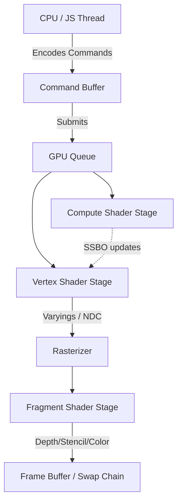

# WebGPU & WebGL: Rendering Pipelines and GPU Memory Optimization

## Rendering Pipeline and Shader Mechanics
WebGPU provides a lower-level, more predictable API compared to WebGL, aligning with modern graphics APIs like Vulkan, Metal, and D3D12. The graphics pipeline requires explicit definition of programmable stages (Vertex and Fragment shaders) authored in WGSL (WebGPU Shading Language) or GLSL (for WebGL). 

The Vertex Shader executes per-vertex, computing normalized device coordinates (NDC) and passing varying data. The rasterizer interpolates this data for the Fragment Shader, which computes per-pixel color and depth outputs. WebGPU separates resource binding from pipeline state via `GPUBindGroup` and `GPUBindGroupLayout`, allowing aggressive pre-compilation and reducing draw call overhead.

GPU memory optimization necessitates careful management of buffers (VBO, UBO, SSBO). Leveraging memory alignment, minimizing host-to-device transfers, and utilizing compute shaders for parallel non-graphics workloads are critical for high-throughput applications.

## Architecture

