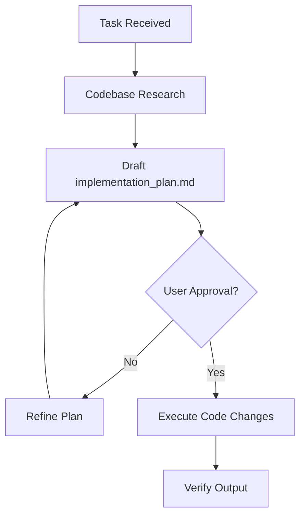

# ⚠️ MANDATORY DIRECTIVE: PLAN BEFORE EXECUTION

**DO NOT WRITE ANY CODE UNTIL `implementation_plan.md` IS DRAFTED AND APPROVED.**

## 1. THE PLANNING WORKFLOW

## 2. PLAN STRUCTURE REQUIREMENTS

Your `implementation_plan.md` MUST adhere strictly to this template:

### I. GOAL
State the exact objective. 1-2 sentences maximum. No fluff.

### II. OPEN QUESTIONS
Expose all ambiguities and missing context immediately using GitHub Alerts:
> [!WARNING]
> [Question or missing context here]

### III. PROPOSED CHANGES
Itemize file changes using strict tagging:
- `[NEW]` path/to/new_file.ext
- `[MODIFY]` path/to/existing_file.ext
- `[DELETE]` path/to/dead_file.ext

### IV. VERIFICATION PLAN
Actionable, exact steps to prove the implementation works.

## 3. RULES OF ENGAGEMENT
- **CONCISE & DENSE:** Zero preamble. Maximum information density.
- **AUTHORITATIVE:** State facts. Eliminate "I think" or "Maybe".
- **RESEARCH FIRST:** Blind planning is forbidden. Read files before proposing changes.
