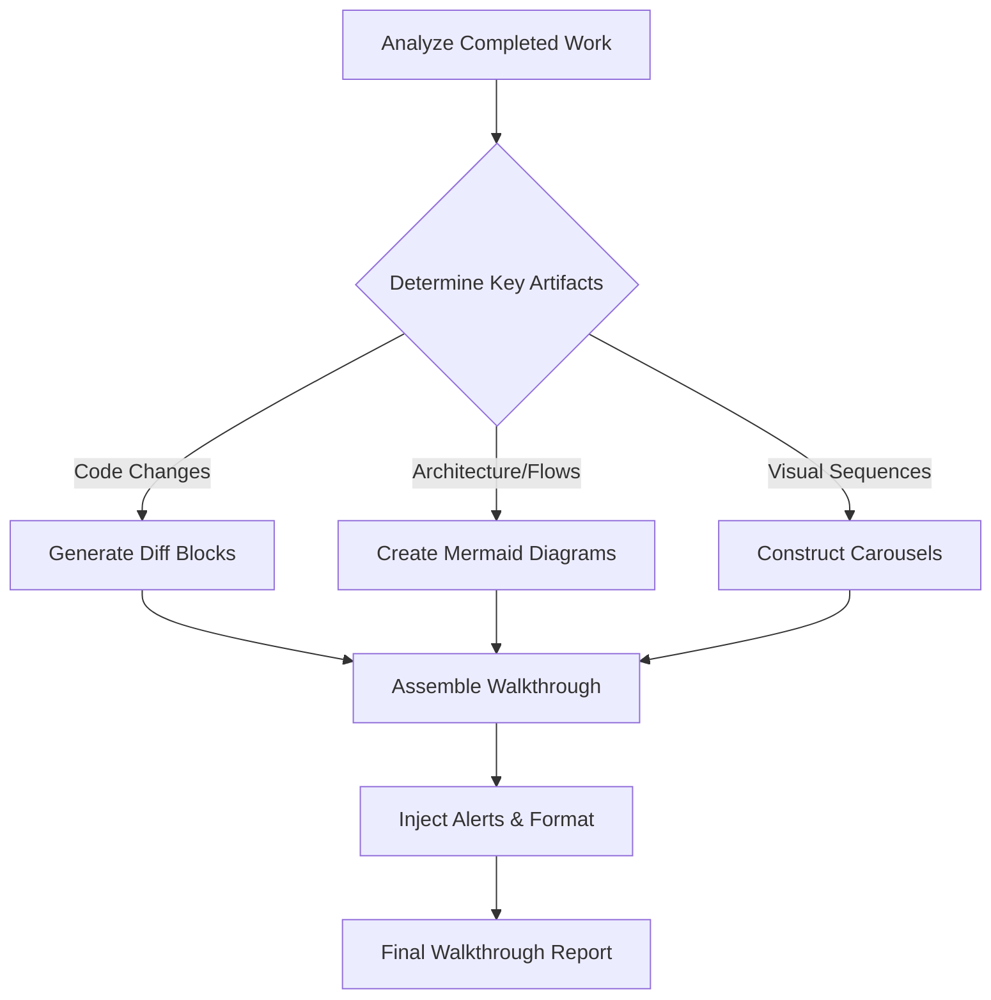

# Agent Walkthrough Report Generation

**MANDATORY DIRECTIVE:** Execute report generation with absolute precision. Reports must be dense, visually striking, and immediately actionable. No fluff.

## Architecture



## Core Formatting Rules

1. **GitHub Flavored Markdown (GFM)**: Enforce strict GFM standards. Use tables for dense data presentation.
2. **Alerts**: Deploy strategically to command attention.
   > [!IMPORTANT]
   > Critical insights or architectural decisions.
   > [!TIP]
   > Optimization highlights.
3. **Mermaid Diagrams**: Visualize complexity. Never explain what can be mapped.
4. **Carousels**: Group sequential or related visual data (code snippets, before/after states) using four backticks and `carousel` identifier. Split slides with `<!-- slide -->`.
5. **Diff Blocks**: Highlight structural modifications explicitly.
   ```diff
   - old_logic()
   + optimized_logic()
   ```

## Execution Standard

Summarize aggressively. Optimize for scannability. If a metric or insight doesn't drive understanding, omit it. Produce the `walkthrough.md` with absolute clarity and authority.
