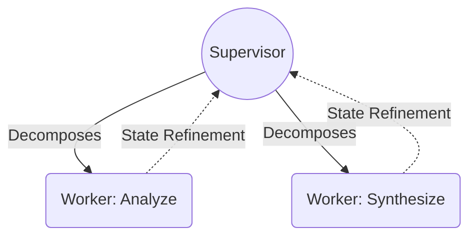
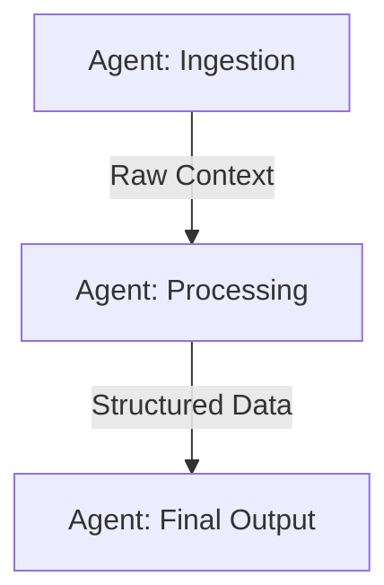
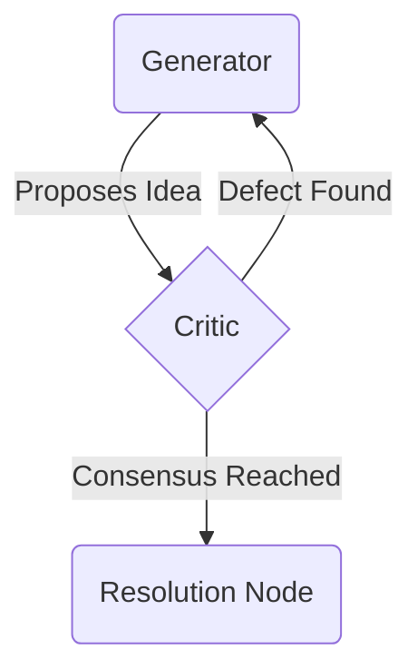

# Multi-Agent Topology: The Societal Structures of AI

At the ontological core of multi-agent systems lies the concept of **Topology**: the formalized graph of interaction, authority, and information flow between autonomous nodes (agents). A single agent possesses limited cognitive aperture; a topology binds multiple cognitive units into a singular, macro-intelligent organism. To master multi-agent design is to architect the sociology of synthetic minds.

These structures transcend frameworks. They are the mathematical and sociological primitives of distributed intelligence.

## I. The Primitives of Topology

1. **Supervisor-Worker (Hierarchical)**
   The classical delegation paradigm. A central orchestrator (Supervisor) decompose tasks, dispatches sub-routines to specialized nodes (Workers), and synthesizes the outputs. This structure minimizes cognitive overload on individual nodes but risks centralizing points of failure.
   *Axiom of Delegation*: The Supervisor must not compute the task; it computes the *routing* and *aggregation* of the task.

2. **Sequential Pipelines (Linear Autonomy)**
   A deterministic chain of cognitive processing. Agent $A_n$ transforms state $S_n$ into $S_{n+1}$, which serves as the immutable input for Agent $A_{n+1}$. This topology enforces extreme strictness and narrow-focus optimization.
   *Axiom of Linearity*: Information flows unilaterally. Entropy decreases at each node as raw data is refined into structured conclusions.

3. **Debate & Reflection Swarms (Polyphonic Convergence)**
   The dialectical approach to truth-seeking. Multiple nodes are instantiated with adversarial or orthogonal personas, iterating on a shared context until a consensus metric is achieved or a maximum reflection depth is reached. 
   *Axiom of Divergence*: Epistemic certainty is achieved not by a single genius node, but through the cross-examination of multiple probabilistic priors.

## II. Topological State Flow

### 1. Hierarchical Topology

### 2. Pipeline Topology

### 3. Swarm Topology

## III. Architectural Imperatives
- **State Immutability**: Context passed between nodes must be cryptographically or structurally immutable to prevent state corruption.
- **Cognitive Bounds**: Never demand a node act outside its topological mandate. A worker does not route; a supervisor does not execute.
- **Topological Fluidity**: Advanced architectures dynamically morph topologies based on task complexity (e.g., initiating a Debate Swarm within a Hierarchical Worker node).
