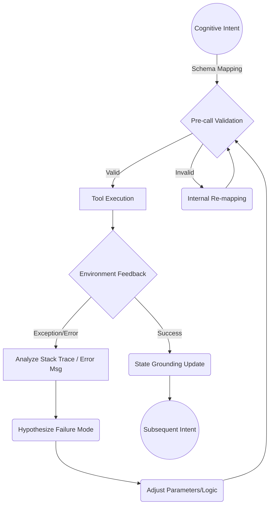

# Tool/Environment Grounding: The Ontology of Action

An agent without tools is a brain in a vat—capable of hallucinating universes but powerless to perturb reality. **Tools are the sensory organs and actuator limbs of synthetic intelligence.** Grounding is the rigorous discipline of tethering probabilistic reasoning to deterministic environments. 

To call a tool is not merely to execute a function; it is to collapse a wave of potential text into a localized impact on the external world.

## I. First Principles of Actuation

1. **Strict Structured Outputs (The Schema Contract)**
   Language models speak in infinite semantic permutations; the environment demands rigid syntactic conformity. The interface between thought and action is the JSON Schema. 
   *Axiom of Structure*: Never rely on emergent formatting. Enforce rigorous type constraints, required fields, and semantic descriptions. The schema is the absolute law governing the interface.

2. **Defensive Calling (The Principle of Skepticism)**
   The environment is hostile, stochastic, and latent. A tool call must be defensive—assuming latency timeouts, malformed responses, or state changes.
   *Axiom of Defense*: Validate assumptions prior to actuation. If reading a file, assume it may be locked or absent. Never commit destructive actions without explicit verification of state.

3. **Error Recovery & Self-Correction (The Resilience Loop)**
   Failure is the default state of complex environments. When a limb fails to grasp an object, the brain does not halt; it recalculates the trajectory. When a tool throws an error, the agent must parse the stack trace, hypothesize the cause, and iterate the call.
   *Axiom of Resilience*: An error is not a termination condition; it is high-fidelity sensory feedback. Catch the exception, reflect on the delta between expectation and reality, and adjust the schema parameters.

## II. The Actuation Cycle

## III. Architectural Imperatives
- **Idempotency**: Whenever possible, tools must be idempotent. Repeating an action must not exponentially compound state degradation.
- **Semantic Density in Descriptions**: The model relies on your tool descriptions to understand its limbs. Describe *when* to use it, *why* it might fail, and *how* to interpret the output.
- **Sensory Saturation**: Ensure the output of a tool provides maximum contextual density. A boolean `true` is insufficient; return the updated state of the environment.
