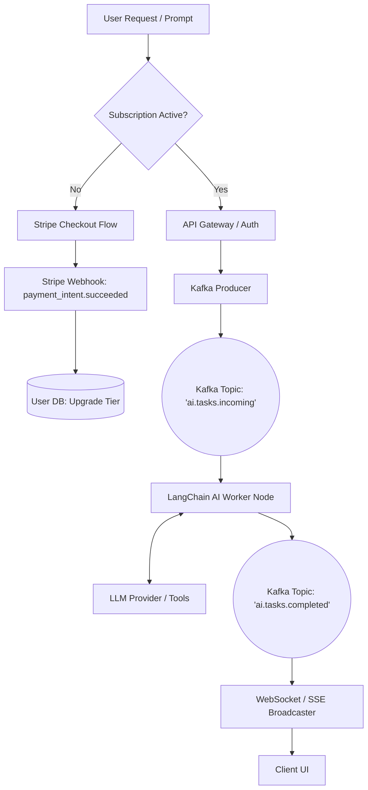

# AI SaaS Master Playbook

**DIRECTIVE**: Execute with absolute precision. Architecture must be robust, scalable, and fault-tolerant. 

## 1. Domain Convergence
- **Intelligence**: LangChain/LlamaIndex for deterministic agentic reasoning and tool execution.
- **Resilience**: Apache Kafka for strictly decoupled, high-throughput, event-driven processing.
- **Monetization**: Stripe for aggressive subscription gating and usage-based billing.

## 2. System Architecture



## 3. Core Orchestration Logic

```python
import os
import json
from fastapi import FastAPI, HTTPException
from kafka import KafkaProducer
import stripe

app = FastAPI()
stripe.api_key = os.getenv("STRIPE_SECRET_KEY")
producer = KafkaProducer(
    bootstrap_servers='kafka:9092',
    value_serializer=lambda v: json.dumps(v).encode('utf-8')
)

@app.post("/api/v1/execute-agent")
async def execute_agentic_workflow(payload: dict):
    user_id = payload.get("user_id")
    prompt = payload.get("prompt")

    # 1. Monetization Gate
    customer = stripe.Customer.retrieve(user_id)
    if not customer.subscriptions.data:
        raise HTTPException(
            status_code=402, 
            detail="Payment required. Please upgrade your tier."
        )

    # 2. Event-Driven Handoff
    task_payload = {"user_id": user_id, "prompt": prompt, "status": "QUEUED"}
    producer.send('ai.tasks.incoming', value=task_payload)
    
    return {"message": "Agent workflow initiated. Await completion via WebSocket."}

# ---------------------------------------------------------
# Background Kafka Consumer & LangChain Worker (Conceptual)
# ---------------------------------------------------------
# def consume_and_process():
#     for msg in consumer('ai.tasks.incoming'):
#         agent = initialize_agent(tools, llm, agent="zero-shot-react-description")
#         result = agent.run(msg.value["prompt"])
#         producer.send('ai.tasks.completed', value={"user_id": msg.value["user_id"], "result": result})
```
