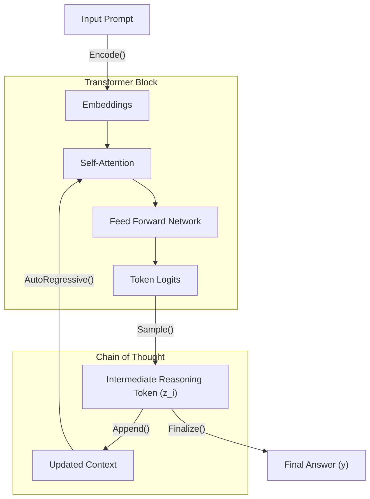

# Chain of Thought (CoT) Prompting Mechanics

## Latent Reasoning Elicitation
Chain of Thought (CoT) acts as a mechanism to externalize latent reasoning steps that the transformer model otherwise attempts to compress into a single forward pass. By coercing the model to generate intermediate tokens, the effective computation allocated to the problem scales linearly with the sequence length (compute-per-token scaling). This breaks complex, multi-hop logical dependencies into localized, attention-manageable segments.

## Token Probability Manipulation
Autoregressive language models generate tokens based on the joint probability distribution conditioned on prior tokens.
In standard zero-shot generation: $P(y|"x)$ where $x$ is the prompt and $y$ is the answer.
In CoT: $P(y"|x, z_1, z_2, ..., z_n)$ where $z_i$ are reasoning steps.
By generating $z_i$, the attention mechanism shifts probability mass toward logically consistent completions. The presence of structural reasoning markers (e.g., "Therefore", "First") strongly biases the top-k token logits towards coherent, logically sound outputs, effectively acting as an explicit regularizer on the distribution space.

