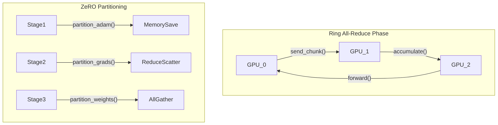

# Distributed Deep Learning Mechanics

## Ring All-Reduce
Synchronous data parallel training requires gradients from all GPUs to be averaged before the optimizer step. Instead of a parameter server bottleneck, Ring All-Reduce organizes N GPUs into a logical ring. The gradient tensors are split into N chunks. During the scatter-reduce phase, GPUs pass chunks around the ring, accumulating sums. After N-1 steps, each GPU holds one fully accumulated chunk. In the subsequent all-gather phase, these complete chunks are circulated. Total network transfer per GPU is 2*(N-1)/N * Size, making it bandwidth-optimal and highly scalable.

## ZeRO Optimizer (Zero Redundancy Optimizer)
Standard Data Parallelism duplicates the entire model state across all GPUs, which is impossible for LLMs like GPT-3. ZeRO eliminates this memory redundancy by partitioning the state.
- **ZeRO Stage 1**: Partitions Optimizer States (e.g., Adam momentum/variance). Cuts memory footprint by 4x.
- **ZeRO Stage 2**: Partitions Gradients. Each GPU only holds gradients for its parameter partition, reducing memory by 8x.
- **ZeRO Stage 3**: Partitions Parameters. Model weights are scattered. Forward/backward passes use dynamic collective communications (All-Gather) to fetch required parameters just-in-time for a layer's computation, and immediately discard them, allowing training of trillion-parameter models.

