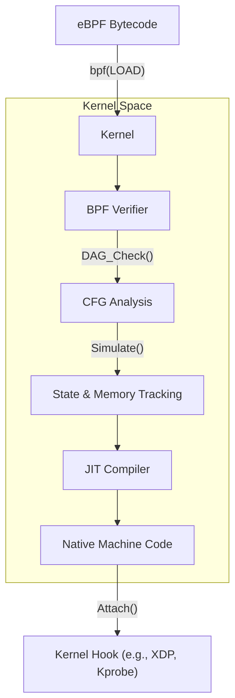

# eBPF Engineering Mechanics

## The eBPF Virtual Machine
eBPF provides a restricted, sandboxed in-kernel virtual machine. Programs are written in C, compiled to eBPF bytecode via LLVM, and loaded into the kernel using the `bpf()` syscall.

## BPF Verifier Constraints
Before execution, the kernel's eBPF verifier performs a static analysis of the bytecode to ensure safety:
1. **DAG Check:** The control flow graph must be a Directed Acyclic Graph (DAG) to guarantee termination (no unbounded loops). BPF-to-BPF calls have strict depth limits.
2. **Memory Access Check:** All pointer arithmetic is validated. Memory accesses must be within the bounds of context structures or valid map entries.
3. **State Pruning:** The verifier simulates execution paths, tracking register states (e.g., bounds, alignment, type) using a mechanism called state pruning to avoid state explosion, though complex programs may still exceed complexity limits (1M instructions).

## JIT Compilation
Once verified, the bytecode is translated into native machine code by the kernel's JIT compiler. This eliminates the overhead of the interpreter. The JIT maps eBPF registers to physical CPU registers and translates eBPF instructions (ALU, jumps) directly to architecture-specific instructions (e.g., x86_64, ARM64), enabling near-native performance for packet filtering and tracing.

