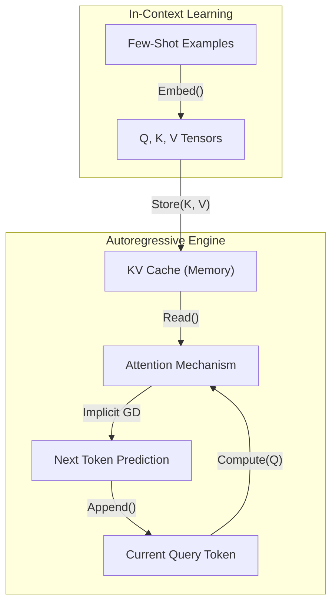

# Few-Shot Prompting Mechanics

## In-Context Learning (ICL)
Few-shot prompting leverages In-Context Learning, where a pre-trained model learns to perform a task at inference time without parameter updates. The attention heads dynamically construct an implicit meta-gradient descent optimization process. The model builds task-specific representations by attending to the input-output mapping patterns (demonstrations) provided in the context window.

## KV Cache Dynamics
During autoregressive generation, Transformers cache the Key (K) and Value (V) tensors for all previously processed tokens to avoid redundant recomputation (KV Caching).
- **Impact of Few-Shot Examples:** Extensive few-shot examples significantly inflate the KV Cache size ($Sequence Length \times Layers \times Hidden Size \times Precision$).
- **Attention Overloading:** As the context grows, attention dilution can occur, where probability mass is spread too thinly across the long KV cache, potentially leading to the "lost in the middle" phenomenon.
- **Prefix Caching:** Modern serving infrastructure (e.g., vLLM) leverages PagedAttention to share KV cache blocks for the few-shot prefix across multiple requests, turning the large context into a highly optimized, amortized cost.

