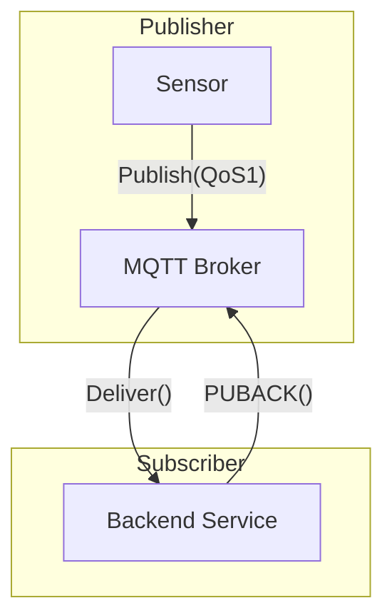

# IoT Protocols: MQTT and CoAP

MQTT is a lightweight publish-subscribe protocol running over TCP/IP. It defines three Quality of Service (QoS) levels: QoS 0 (at most once), QoS 1 (at least once, requiring a PUBACK), and QoS 2 (exactly once, using a four-step handshake). 

CoAP (Constrained Application Protocol) is designed for UDP-based networks. It maps HTTP semantics to a compact binary format, utilizing a fixed 4-byte header. CoAP supports request/response patterns and multicast, making it suitable for lossy networks (LLNs) where TCP overhead is prohibitive.

