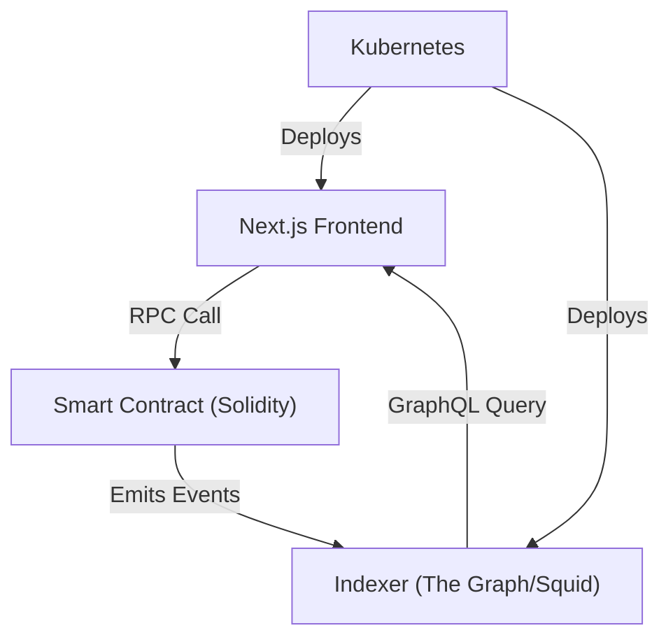

# Web3 DApp Playbook

**MẠNH. CONCISE. AUTHORITATIVE.**

## 1. Architecture Map



## 2. Core Directives

1. **Frontend**: Next.js (App Router). Strict typing. Server components where possible.
2. **Contracts**: Solidity. Foundry for testing. CI/CD requires 100% test coverage.
3. **Deployment**: Kubernetes. Helm charts for deterministic state.
4. **Integration**: No direct DB writes from frontend for on-chain state. Always read from indexer.

## 3. Unified Scaffold (Makefile)

```makefile
.PHONY: build deploy-contracts deploy-k8s

# Build all layers
build:
	cd frontend && npm install && npm run build
	cd contracts && forge build
	cd indexer && npm install && npm run build

# Deploy contracts to testnet/mainnet
deploy-contracts:
	cd contracts && forge script script/Deploy.s.sol --rpc-url $(RPC_URL) --broadcast

# Deploy infrastructure via kubectl
deploy-k8s:
	kubectl apply -f k8s/namespace.yaml
	kubectl apply -f k8s/frontend-deployment.yaml
	kubectl apply -f k8s/indexer-deployment.yaml
	kubectl rollout status deployment/frontend -n web3
```

Execute with precision. No deviations.
