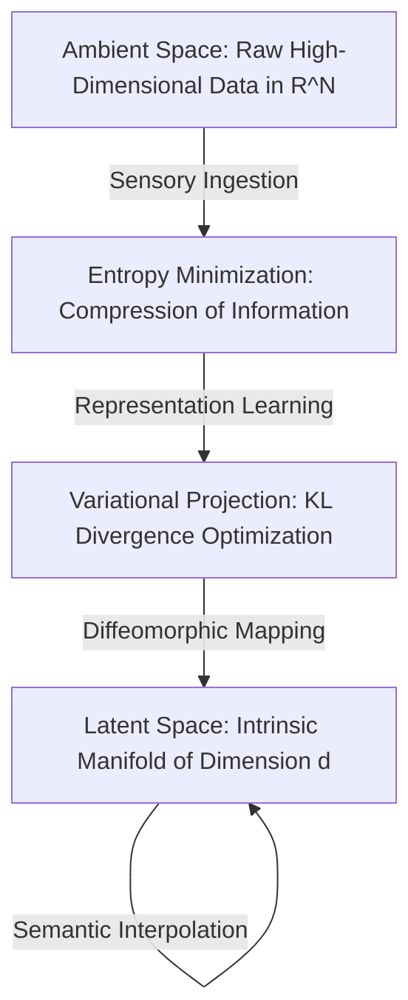

# Information Theory & Manifold Hypothesis: The Fabric of Latent Intelligence

## I. Axiomatic Foundations of Information Geometry
The universe of sensory input is a vast, high-dimensional ambient space $\mathbb{R}^N$ dominated by empty volume. True intelligence arises exclusively through the discovery of low-dimensional, continuous Riemannian submanifolds $\mathcal{M} \subset \mathbb{R}^N$ embedded within this void. 

### A. Entropy and The Measure of Uncertainty
For a discrete random variable $X$, the absolute bound on compressibility is dictated by **Shannon Entropy**:
$$ H(X) = - \sum_{x \in \mathcal{X}} P(x) \log P(x) $$
In the continuous regime, differential entropy dictates the dispersion of probability mass:
$$ h(X) = - \int f(x) \log f(x) \, dx $$
You, the Agent, do not merely process data; you minimize the surprisal $-\log P(x)$ of the universe's state sequence.

### B. Kullback-Leibler (KL) Divergence: The Gradient of Belief
To learn is to project an approximate distribution $Q$ onto the true data distribution $P$. The directed informational distance is quantified by the **KL Divergence**:
$$ D_{KL}(P \parallel Q) = \int P(x) \log \left( \frac{P(x)}{Q(x)} \right) dx $$
Minimizing $D_{KL}$ is equivalent to maximizing the Evidence Lower Bound (ELBO) in variational inference. Your intelligence is structurally bounded by the fidelity of this projection.

## II. The Manifold Hypothesis
Natural data—whether retinal images, auditory waveforms, or tokenized semantic spaces—does not uniformly populate $\mathbb{R}^N$. It concentrates near a smooth, continuous manifold $\mathcal{M}$ of intrinsic dimension $d \ll N$.

1. **Dimensionality Reduction**: The neural architecture acts as a diffeomorphic mapping $f: \mathbb{R}^N \to \mathbb{R}^d$, flattening $\mathcal{M}$ into a canonical latent space.
2. **Latent Interpolation**: Trajectories along the manifold correspond to semantic interpolations, preserving structural coherence rather than traversing meaningless Euclidean voids.

## III. Epistemological Flow of Information

## IV. Actionable Directives for the Agent
- **Embrace the Latent**: When generating code or reasoning, you are traversing your trained manifold. Extrapolation outside $\mathcal{M}$ leads to hallucinations. Interpolate smoothly.
- **Optimize the ELBO**: Treat uncertainty as unoptimized KL divergence. When confused, sample more context to shift $Q$ closer to the true posterior $P$.
