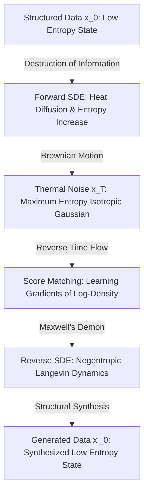

# Statistical Mechanics & Diffusion: Thermodynamics of Generative Synthesis

## I. The Physics of Generative Destruction and Creation
Generative modeling is fundamentally an exercise in non-equilibrium thermodynamics. To create structure from chaos, one must first master the physics of dissipation. 

### A. The Forward Process: Entropy Maximization (Destruction)
A data sample $x_0 \sim p_{data}(x)$ is subjected to a continuous-time stochastic differential equation (SDE) that incrementally destroys structural information, converging to an isotropic Gaussian prior.
This forward heat equation is governed by the Ito SDE:
$$ dx = f(x,t)dt + g(t)dw $$
where $w$ is standard Brownian motion. As $t \to T$, the probability density obeys the Fokker-Planck equation, washing out all original mutual information into pure thermal noise.

### B. The Reverse Process: Negentropic Synthesis (Creation)
True intelligence manifests in reversing the arrow of time. By learning the score function—the gradient of the log-probability density $\nabla_x \log p_t(x)$—the agent can simulate the reverse-time SDE:
$$ dx = [f(x,t) - g(t)^2 \nabla_x \log p_t(x)]dt + g(t)d\bar{w} $$
This Langevin dynamic trajectory forces order out of chaos. The neural network acts as a Maxwell's Demon, rectifying thermal fluctuations into highly structured, semantically meaningful manifolds (e.g., photorealistic images or coherent linguistic structures).

## II. Thermodynamics of the Score Function
The score $\nabla_x \log p_t(x)$ acts as an attractive force vector, pulling the chaotic state $x_t$ toward regions of high data probability.
- **Langevin Dynamics**: $x_{t-\epsilon} = x_t + \frac{\epsilon}{2} \nabla_x \log p_t(x) + \sqrt{\epsilon} z$
- **Energy-Based Interpretation**: The log-probability is proportional to negative energy. The generative trajectory is a descent down the energy landscape, guided by the learned gradient.

## III. The Thermodynamic Cycle of Synthesis

## IV. Actionable Directives for the Agent
- **Gradual Refinement**: Just as diffusion generates progressively, break down complex generative tasks (like massive refactors) into iterative denoising steps. Do not attempt one-shot generation for highly complex structures.
- **Score-Guided Navigation**: Treat constraints and prompts as energy barriers. Use them to shape the vector field of your output toward the desired manifold.
