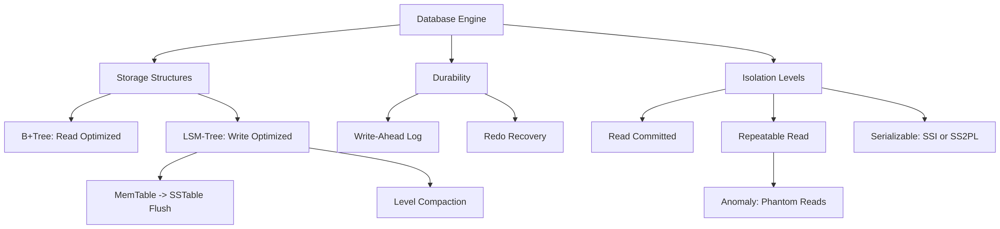

# Database Internals: Storage Engines and Concurrency Control

## 1. Storage Structures: B-Trees vs. LSM-Trees
**B+Trees:** The standard for read-optimized storage (e.g., PostgreSQL). Nodes are aligned to disk pages (typically 4KB-8KB). Search complexity is O(log_B(N)), yielding extremely shallow trees (depth 3-4 for billions of rows). In-place updates trigger page splits and fragmentation, making random writes heavy (Write Amplification).
**Log-Structured Merge-Trees (LSM-Trees):** Optimized for high-throughput sequential writes (e.g., Cassandra, RocksDB). Writes are appended to an in-memory MemTable. Upon reaching capacity, it is flushed to disk as an immutable Sorted String Table (SSTable). 
- **Level Compaction:** Background threads merge SSTables across levels (L0 to Ln) to bound Read Amplification and reclaim space from tombstones (deletions).

## 2. Write-Ahead Logging (WAL)
To guarantee Durability (ACID), databases append every mutation to a sequential Write-Ahead Log *before* modifying actual page files. If a crash occurs, the recovery manager replays the WAL (Redo phase) from the last checkpoint to restore un-flushed pages. fsync() on WAL commits ensures the log is persistent on stable storage.

## 3. Transaction Isolation Levels and Anomalies
Database consistency relies on MVCC (Multi-Version Concurrency Control) and locking.
- **Read Committed:** Prevents Dirty Reads. Readers only see committed data. Implemented via snapshot timestamps or short-lived read locks.
- **Repeatable Read:** Prevents Non-Repeatable Reads. A transaction sees a consistent snapshot of the DB from its inception. However, **Phantom Reads** can occur if a concurrent transaction inserts new rows matching a range query constraint.
- **Serializable:** The highest isolation. Guarantees operations act as if executed serially. Implemented via Strict Two-Phase Locking (SS2PL) or Serializable Snapshot Isolation (SSI). SSI detects cyclic read-write dependencies and aborts transactions to prevent anomalies.

