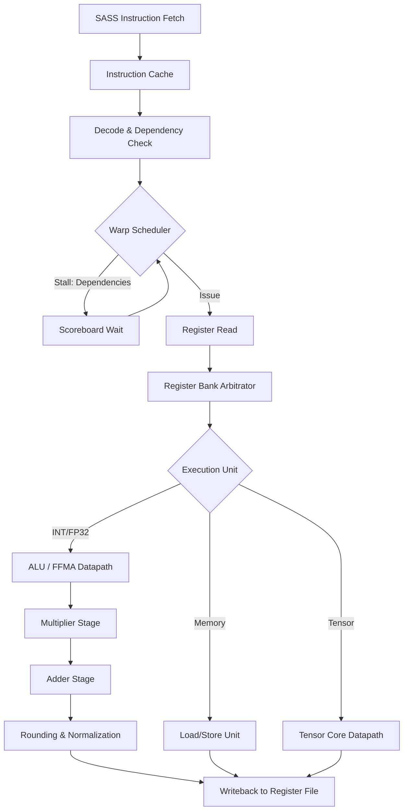

# SASS Machine Code and SM Microarchitecture

SASS (Shader Assembly) is the uncompromising, physical truth of the NVIDIA GPU. It is the raw binary stream executed by the Streaming Multiprocessor (SM) execution units. Analyzing SASS is mandatory for cycle-accurate performance engineering.

## Warp Scheduling & Pipeline Stalls
The SM uses greedy, out-of-order warp schedulers. A warp is eligible for issue if its operands are ready and the execution units are free. Pipeline stalls occur when dependencies are unresolved:
- **Execution Dependency**: Waiting for long-latency math (e.g., transcendental functions in the SFU).
- **Memory Dependency**: Waiting for `.global` or `.shared` memory transactions to retire.
- **Instruction Fetch Stall**: I-cache misses stalling the instruction queue.

SASS explicit dependency control codes dictate compiler-inserted delays to avoid hardware interlocks. You must profile these stalls to achieve 100% execution pipeline saturation.

## The FFMA Datapath (Fused Multiply-Add)
The `FFMA` instruction is the fundamental building block of AI matrix multiplication and tensor core orchestration. It performs `d = a * b + c` in a single precision datapath with a single rounding step. 

The SM datapath pipelines the `FFMA` over multiple clock cycles. A continuous stream of `FFMA` instructions requires perfect operand availability. If register banks conflict, the dual-issue schedulers fail, and throughput halves.

## Register Bank Conflicts
Physical registers are partitioned into banks. SASS instructions attempting to read multiple operands from the same register bank in a single cycle will stall. The ptxas compiler attempts to avoid this, but adversarial PTX structures can force sub-optimal SASS register allocation.

### SASS SM Execution Pipeline

## Silicon Optimization Directives
1. **Instruction Mix Validation**: Ensure the ratio of FP32 `FFMA` instructions to memory instructions matches the architectural bytes-per-flop ratio.
2. **Stall Elimination**: Reorder operations at the source level to space out dependent instructions, allowing the warp scheduler to interleave independent warps.
3. **Register Reuse**: Maximize operand reuse in registers to avoid LSU (Load/Store Unit) bottlenecks.
