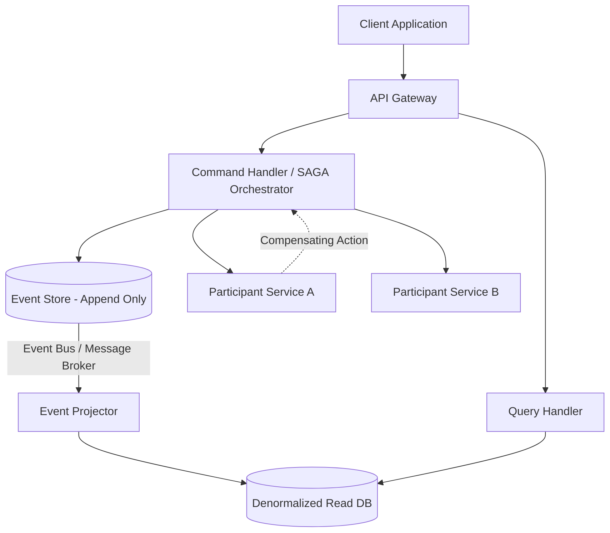

# Advanced Microservice Architecture Patterns

Distributed systems demand rigorous data consistency models and scalable communication pipelines. This reference explores advanced patterns for transaction management and state propagation in highly decoupled topologies.

## 1. The SAGA Pattern: Distributed Transactions

In microservices, traditional ACID transactions (2PC/Two-Phase Commit) are antipatterns due to synchronous blocking and lock contention. SAGA mitigates this by decomposing a distributed transaction into a sequence of local ACID transactions.

If a local transaction fails, the SAGA executes **compensating transactions** to rollback the preceding steps, achieving eventual consistency.

### Choreography vs. Orchestration
- **Choreography (Event-Driven):** Services publish domain events upon completing their local transactions. Other services subscribe to these events and trigger their respective local transactions. There is no centralized controller.
  - *Pros:* Highly decoupled, no single point of failure.
  - *Cons:* Emergent complexity; difficult to trace the lifecycle of a complex transaction.
- **Orchestration (Command-Driven):** A centralized orchestrator (e.g., an AWS Step Function or Camunda engine) manages the transaction lifecycle. It issues commands to participant services and handles failure logic.
  - *Pros:* Centralized observability, straightforward compensation logic.
  - *Cons:* The orchestrator can become a god-object and a bottleneck.

## 2. CQRS: Command Query Responsibility Segregation

CQRS separates the data modification (Command) and data retrieval (Query) pipelines, acknowledging that read and write workloads scale asymmetrically and require different storage paradigms.

- **Command Model:** Highly normalized, focuses on business rules, validation, and transaction boundaries. Often backed by a relational database or event store.
- **Query Model:** Highly denormalized, materialized views optimized for specific UI read operations. Often backed by NoSQL, Elasticsearch, or Redis.
- **Synchronization:** The Command side emits events upon state changes. The Query side projects these events into its read-optimized data stores. This introduces an eventual consistency window.

## 3. Event Sourcing

Instead of storing the current state of an entity, Event Sourcing stores a purely append-only log of immutable domain events. The current state is derived by replaying the event stream (Left Fold).

- **Immutability:** Data is never updated or deleted. This guarantees an unimpeachable audit trail.
- **Snapshots:** To avoid replaying millions of events for an entity, snapshots of the current state are periodically materialized.
- **Synergy with CQRS:** Event Sourcing naturally pairs with CQRS. The event store acts as the Command model, and event handlers build the Query model projections.

## 4. Architectural Diagram

