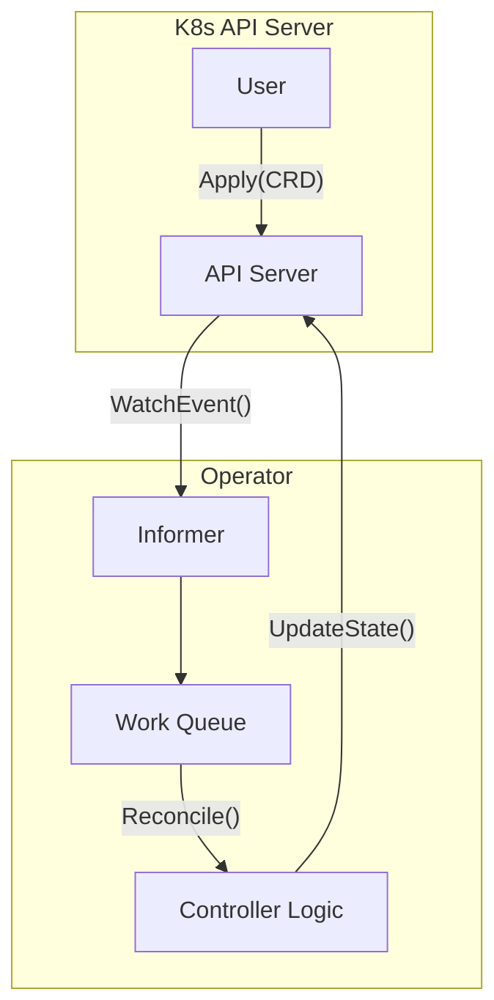

# Kubernetes Operators and CRDs

Kubernetes Operators encode human operational knowledge into software. They build upon Custom Resource Definitions (CRDs), which extend the Kubernetes API.

The core mechanism is the reconciliation loop. The Operator watches for changes to its CRD via the Kubernetes API server (using watch requests). When an event (Add, Update, Delete) is detected, the resource is placed in a work queue. The worker pulls from the queue and executes the reconcile function, comparing the current state of the cluster with the desired state declared in the CRD, and taking actions (e.g., creating Pods, Services) to align them.

