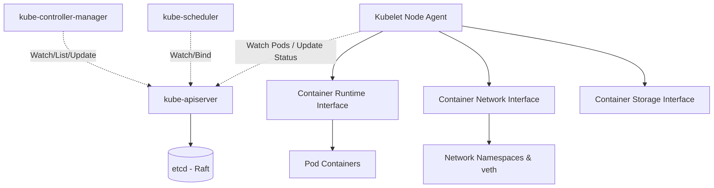

# Kubernetes Control Plane Internals

Kubernetes is a declarative, state-reconciling system. Its architecture is fundamentally driven by a distributed control loop paradigm, backed by a strongly consistent distributed key-value store.

## 1. The Core: etcd and the Raft Consensus Algorithm

All cluster state (configuration, specifications, statuses) resides in `etcd`. It guarantees linearizability through the Raft consensus algorithm.

- **Raft Mechanics:** etcd operates via a leader-follower topology. Write requests are routed to the leader, which appends the entry to its log and broadcasts `AppendEntries` RPCs to followers. A write is committed only when a quorum (majority) acknowledges the append.
- **MVCC (Multi-Version Concurrency Control):** etcd maintains historical versions of keys. This allows Kubernetes controllers to `WATCH` for changes effectively without polling.
- **Resource Revisions:** Every object in Kubernetes has a `resourceVersion`. This is mapped directly to the etcd revision, preventing lost updates via optimistic concurrency control (Compare-and-Swap).

## 2. kube-apiserver: The Central Nervous System

The `kube-apiserver` is the singular gateway to the cluster state. It is a stateless, horizontally scalable REST interface, but its core power lies in its event loop and watch mechanisms.

- **Request Flow:** Authentication -> Authorization (RBAC) -> Admission Control (Mutating, Validating) -> etcd interaction.
- **Informer Pattern & Watch:** Controllers rarely poll. Instead, they open a chunked HTTP transfer connection to the apiserver, subscribing to a continuous stream of events (`ADDED`, `MODIFIED`, `DELETED`). This is facilitated by the `SharedInformer` cache, which reduces apiserver load.

## 3. The Reconciler Pattern (Controllers & kube-controller-manager)

The `kube-controller-manager` runs continuous control loops. A reconciler strictly adheres to this pseudo-logic:

```go
func (c *Controller) Reconcile(request Request) (Result, error) {
    // 1. Observe the current state from the informer cache
    currentState := c.lister.Get(request.Name)
    
    // 2. Determine the desired state (e.g., from the object's Spec)
    desiredState := getDesiredState(currentState)
    
    // 3. Actuate: compute the delta and apply mutations
    if currentState != desiredState {
        c.client.Update(desiredState)
    }
}
```

## 4. Node Autonomy: The Kubelet

The `kubelet` is the primary node agent. It watches the apiserver for Pod bindings assigned to its node.
- **Pod Lifecycle:** Upon detecting a new Pod assignment, the kubelet interfaces with the Container Runtime Interface (CRI) to spawn containers, the Container Storage Interface (CSI) for volume mounts, and the Container Network Interface (CNI) for IP allocation.
- **cAdvisor:** Integrated within the kubelet to collect granular cgroup resource utilization metrics.

## 5. CNI: Container Network Interface

CNI dictates how network namespaces are wired.
- When a pod is scheduled, the container runtime creates an isolated network namespace.
- The runtime invokes the CNI binary (e.g., Calico, Flannel) with an `ADD` command.
- The CNI creates a veth pair (one end in the pod namespace, the other in the host namespace), assigns an IP, and configures routing.

## 6. Architectural Diagram


