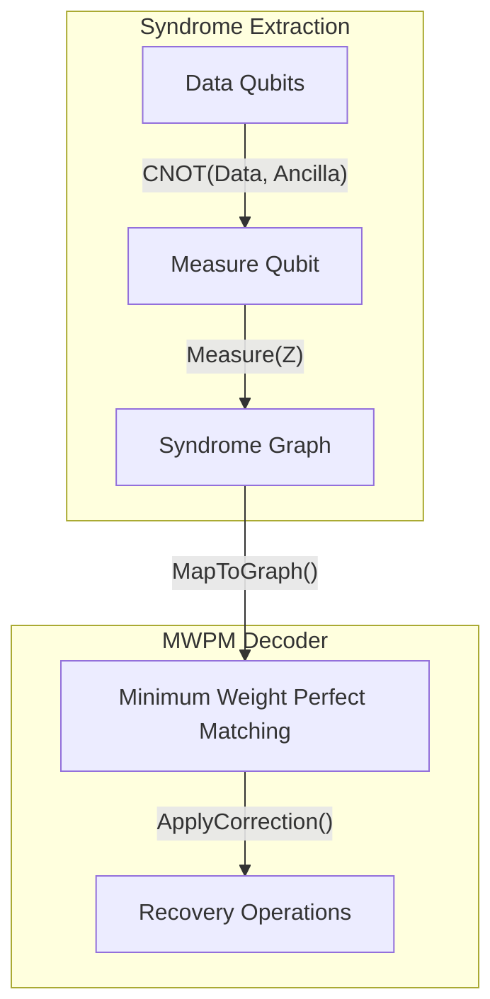

# Quantum Error Correction (QEC)

QEC protects fragile quantum information from decoherence and environmental noise using logical qubits encoded across multiple physical qubits.

## Surface Codes and Topological Qubits
Surface codes are a class of stabilizer codes mapped onto a 2D lattice.
- Qubits are placed on the edges of the lattice.
- Star (vertex) operators $A_v = \prod_{i \in \text{star}} X_i$ and plaquette operators $B_p = \prod_{i \in \text{boundary}} Z_i$ form the stabilizer generators.

## Syndrome Measurement
Error detection occurs without measuring the logical state via syndrome extraction circuits using ancillary measure qubits.

### Decoder Topology
The Minimum Weight Perfect Matching (MWPM) algorithm pairs any detected error defects (anyons) in the space-time syndrome graph.
